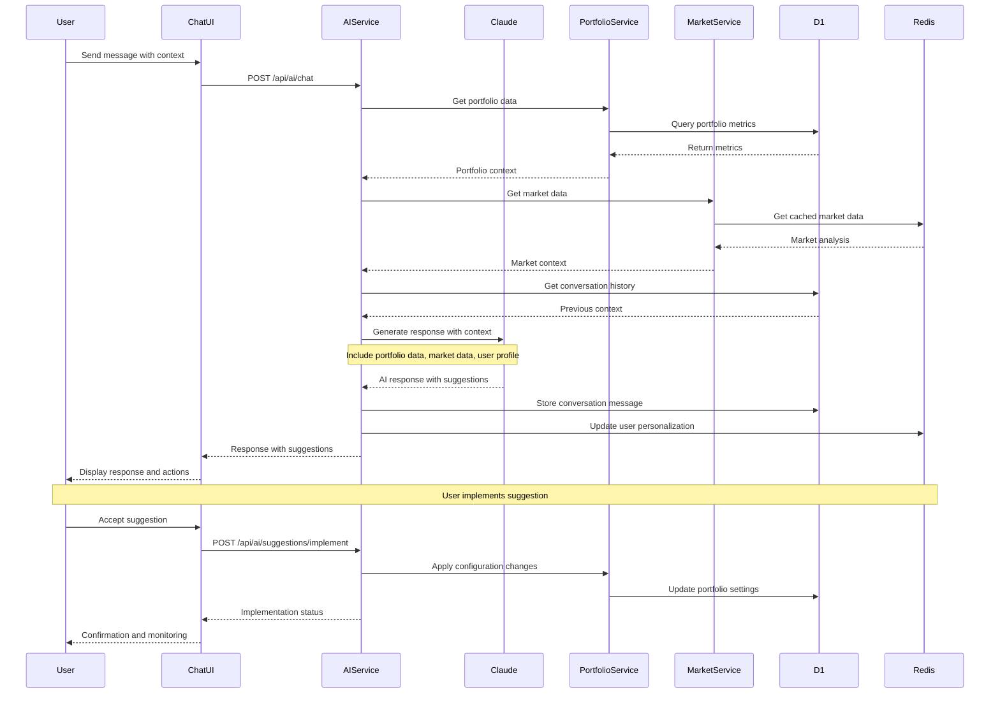

# Feature Specification: AI-Powered Analytics

## Overview
- Feature ID: FEAT-003
- User Story References: US-009, US-010, US-011, US-012, US-013
- Priority: P1 (Critical - Core Differentiator)
- Estimated Tokens: 78k

## Visual Design Reference
- Figma Link: N/A (Business planning phase)
- Key Screens: Chat Interface, AI Insights Dashboard, Recommendation Cards, Conversation History
- Design Tokens: Modern chat UI with Claude-style interface, insight cards with data visualizations

## API Specification

### Endpoint: POST /api/ai/chat
**Purpose:** Send message to AI agent and receive personalized response
**Authentication:** JWT token required

**Request:**
```json
{
  "message": "How can I optimize my RTX 4090 pricing for maximum revenue?",
  "conversationId": "conv_550e8400-e29b-41d4-a716-446655440000",
  "context": {
    "portfolioId": "portfolio_abc123-def456-ghi789",
    "currentPage": "/dashboard/portfolio/abc123",
    "selectedTimeRange": "7d",
    "userIntent": "optimization_request"
  },
  "attachments": [
    {
      "type": "portfolio_data",
      "portfolioId": "portfolio_abc123-def456-ghi789"
    }
  ]
}
```

**Response (200 OK):**
```json
{
  "success": true,
  "data": {
    "messageId": "msg_789xyz-abc123-def456",
    "conversationId": "conv_550e8400-e29b-41d4-a716-446655440000",
    "response": {
      "text": "Based on your RTX 4090 portfolio performance, I can see several optimization opportunities:\n\n**Current Analysis:**\n- Your current rate of $2.50/hour is 15% below market average\n- Utilization at 87% is excellent, indicating strong demand\n- Temperature averaging 74°C shows good thermal management\n\n**Recommendations:**\n1. **Increase pricing to $2.65/hour** - This aligns with top 25% of market rates\n2. **Implement dynamic pricing** during peak hours (6-10 PM EST)\n3. **Add 10% weekend premium** - demand increases 23% on weekends\n\n**Expected Impact:**\n- Monthly revenue increase: $340 (+12.8%)\n- Utilization may drop slightly to 82-85% (still excellent)\n- ROI improvement: 2.1 months faster payback\n\nWould you like me to help you implement these changes gradually?",
      "suggestions": [
        {
          "id": "pricing_optimization",
          "title": "Optimize Pricing Strategy",
          "description": "Adjust hourly rates based on market analysis",
          "confidence": 0.92,
          "impact": "high",
          "effort": "low",
          "actions": [
            {
              "type": "update_pricing",
              "portfolioId": "portfolio_abc123-def456-ghi789",
              "gpuId": "gpu_instance_001",
              "newRate": 2.65,
              "reasoning": "Market analysis shows 15% underpricing"
            }
          ]
        },
        {
          "id": "dynamic_pricing",
          "title": "Enable Dynamic Pricing",
          "description": "Implement time-based pricing adjustments",
          "confidence": 0.87,
          "impact": "medium",
          "effort": "medium",
          "actions": [
            {
              "type": "configure_dynamic_pricing",
              "portfolioId": "portfolio_abc123-def456-ghi789",
              "schedule": {
                "peak_hours": ["18:00-22:00"],
                "premium": 0.15
              }
            }
          ]
        }
      ],
      "visualizations": [
        {
          "type": "pricing_comparison_chart",
          "title": "Your Pricing vs Market",
          "data": {
            "your_rate": 2.50,
            "market_average": 2.89,
            "top_25_percent": 3.15,
            "recommended": 2.65
          }
        },
        {
          "type": "revenue_projection",
          "title": "Expected Revenue Impact",
          "data": {
            "current_monthly": 2640,
            "projected_monthly": 2980,
            "increase_amount": 340,
            "increase_percentage": 12.8
          }
        }
      ],
      "sources": [
        {
          "type": "market_data",
          "source": "500.farm API",
          "timestamp": "2024-01-20T16:45:00Z",
          "confidence": 0.95
        },
        {
          "type": "portfolio_metrics",
          "source": "user_portfolio_data",
          "timestamp": "2024-01-20T16:40:00Z",
          "confidence": 1.0
        }
      ]
    },
    "usage": {
      "tokensUsed": 1247,
      "quotaRemaining": 8753,
      "quotaResetDate": "2024-02-01T00:00:00Z",
      "tier": "individual"
    },
    "personalization": {
      "userProfileUpdated": true,
      "confidenceLevel": "high",
      "communicationStyle": "technical_detailed",
      "preferredMetrics": ["revenue", "roi", "utilization"]
    },
    "timestamp": "2024-01-20T16:45:23Z"
  }
}
```

**Error Responses:**
- 400: Invalid message format or missing context
- 402: Quota exceeded, upgrade required
- 429: Rate limit exceeded (10 messages per minute)
- 503: AI service temporarily unavailable

### Endpoint: GET /api/ai/conversations
**Purpose:** List user's conversation history with search and filtering
**Authentication:** JWT token required

**Request Query Parameters:**
```typescript
interface ConversationListQuery {
  limit?: number; // Default 20, max 100
  offset?: number;
  search?: string; // Search in conversation titles and messages
  dateFrom?: string; // ISO date string
  dateTo?: string; // ISO date string
  portfolioId?: string; // Filter by portfolio context
  hasActions?: boolean; // Filter conversations with actionable suggestions
}
```

**Response (200 OK):**
```json
{
  "success": true,
  "data": {
    "conversations": [
      {
        "id": "conv_550e8400-e29b-41d4-a716-446655440000",
        "title": "RTX 4090 Pricing Optimization",
        "summary": "Discussion about market positioning and pricing strategy for RTX 4090 portfolio",
        "messageCount": 8,
        "lastMessage": {
          "timestamp": "2024-01-20T16:45:23Z",
          "preview": "Would you like me to help you implement these changes gradually?"
        },
        "context": {
          "portfolioIds": ["portfolio_abc123-def456-ghi789"],
          "topics": ["pricing", "optimization", "revenue"],
          "actionsGenerated": 3,
          "actionsImplemented": 1
        },
        "createdAt": "2024-01-20T14:30:00Z",
        "updatedAt": "2024-01-20T16:45:23Z"
      }
    ],
    "pagination": {
      "total": 15,
      "limit": 20,
      "offset": 0,
      "hasMore": false
    },
    "summary": {
      "totalConversations": 15,
      "totalMessages": 124,
      "totalActionsGenerated": 47,
      "totalActionsImplemented": 23,
      "averageConversationLength": 8.3,
      "topTopics": ["pricing", "optimization", "troubleshooting", "market_analysis"]
    }
  }
}
```

### Endpoint: GET /api/ai/conversations/{conversationId}
**Purpose:** Get detailed conversation history with all messages and context
**Authentication:** JWT token required, conversation ownership verified

**Response (200 OK):**
```json
{
  "success": true,
  "data": {
    "id": "conv_550e8400-e29b-41d4-a716-446655440000",
    "title": "RTX 4090 Pricing Optimization",
    "summary": "Discussion about market positioning and pricing strategy for RTX 4090 portfolio",
    "context": {
      "portfolioIds": ["portfolio_abc123-def456-ghi789"],
      "topics": ["pricing", "optimization", "revenue"],
      "userIntent": "optimization_request",
      "technicalLevel": "intermediate"
    },
    "messages": [
      {
        "id": "msg_001",
        "role": "user",
        "content": "How can I optimize my RTX 4090 pricing for maximum revenue?",
        "timestamp": "2024-01-20T14:30:00Z",
        "context": {
          "portfolioId": "portfolio_abc123-def456-ghi789",
          "currentPage": "/dashboard/portfolio/abc123"
        }
      },
      {
        "id": "msg_002",
        "role": "assistant",
        "content": "Based on your RTX 4090 portfolio performance, I can see several optimization opportunities...",
        "timestamp": "2024-01-20T14:30:15Z",
        "suggestions": [
          {
            "id": "pricing_optimization",
            "title": "Optimize Pricing Strategy",
            "status": "implemented",
            "implementedAt": "2024-01-20T15:15:00Z"
          }
        ],
        "visualizations": [
          {
            "type": "pricing_comparison_chart",
            "title": "Your Pricing vs Market"
          }
        ],
        "usage": {
          "tokensUsed": 1247,
          "processingTime": 3200
        }
      }
    ],
    "personalization": {
      "userProfile": {
        "technicalLevel": "intermediate",
        "preferredCommunicationStyle": "detailed_with_examples",
        "primaryGoals": ["revenue_optimization", "risk_minimization"],
        "preferredMetrics": ["revenue", "roi", "utilization"],
        "portfolioFocus": ["high_end_gaming", "ai_training"]
      },
      "learningData": {
        "commonQuestions": [
          "pricing_optimization",
          "market_analysis", 
          "performance_troubleshooting"
        ],
        "successfulRecommendations": [
          "dynamic_pricing",
          "overclock_optimization"
        ],
        "dismissedSuggestions": [
          "platform_diversification"
        ]
      }
    },
    "createdAt": "2024-01-20T14:30:00Z",
    "updatedAt": "2024-01-20T16:45:23Z"
  }
}
```

### Endpoint: POST /api/ai/suggestions/{suggestionId}/implement
**Purpose:** Implement AI-generated suggestion with user confirmation
**Authentication:** JWT token required, suggestion ownership verified

**Request:**
```json
{
  "confirmImplementation": true,
  "customizations": {
    "newRate": 2.60,
    "gradualRollout": true,
    "rolloutPeriod": "24_hours",
    "monitoringThresholds": {
      "utilizationDrop": 0.10,
      "revenueDrop": 0.05
    }
  },
  "notes": "Starting with conservative 2.60 rate, will monitor for 24h before full implementation"
}
```

**Response (200 OK):**
```json
{
  "success": true,
  "data": {
    "suggestionId": "pricing_optimization",
    "implementationId": "impl_abc123-def456-ghi789",
    "status": "implementing",
    "progress": {
      "currentStep": "applying_pricing_changes",
      "totalSteps": 4,
      "estimatedCompletion": "2024-01-20T17:15:00Z"
    },
    "changes": {
      "portfolioId": "portfolio_abc123-def456-ghi789",
      "gpuId": "gpu_instance_001",
      "oldRate": 2.50,
      "newRate": 2.60,
      "rolloutSchedule": {
        "startTime": "2024-01-20T17:00:00Z",
        "endTime": "2024-01-21T17:00:00Z",
        "checkpoints": [
          "2024-01-20T21:00:00Z",
          "2024-01-21T09:00:00Z",
          "2024-01-21T17:00:00Z"
        ]
      }
    },
    "monitoring": {
      "alertsConfigured": true,
      "metricsTracked": ["utilization", "revenue", "demand"],
      "rollbackConditions": {
        "utilizationDrop": "> 10%",
        "revenueDrop": "> 5%",
        "errorRate": "> 2%"
      }
    },
    "implementedAt": "2024-01-20T17:00:00Z"
  }
}
```

### Endpoint: GET /api/ai/insights
**Purpose:** Get proactive AI insights and recommendations without chat interaction
**Authentication:** JWT token required

**Request Query Parameters:**
```typescript
interface InsightsQuery {
  portfolioId?: string; // Specific portfolio or all
  category?: 'optimization' | 'market' | 'performance' | 'risk' | 'opportunity';
  priority?: 'high' | 'medium' | 'low';
  limit?: number; // Default 10, max 50
}
```

**Response (200 OK):**
```json
{
  "success": true,
  "data": {
    "insights": [
      {
        "id": "insight_market_opportunity_001",
        "category": "opportunity",
        "priority": "high",
        "title": "AI Training Demand Surge Detected",
        "description": "Market analysis shows 34% increase in AI training job demand for RTX 4090s over the past 3 days",
        "context": {
          "portfolioIds": ["portfolio_abc123-def456-ghi789"],
          "timeframe": "3d",
          "confidence": 0.94
        },
        "recommendation": {
          "action": "increase_pricing",
          "description": "Consider increasing hourly rates by 8-12% to capitalize on increased demand",
          "expectedImpact": {
            "revenueIncrease": 0.08,
            "utilizationChange": -0.02,
            "riskLevel": "low"
          }
        },
        "data": {
          "demandIncrease": 0.34,
          "marketRate": 2.89,
          "yourRate": 2.50,
          "competitorRates": [2.75, 2.95, 3.10, 2.65]
        },
        "actions": [
          {
            "type": "update_pricing",
            "label": "Increase Rate to $2.80",
            "confidence": 0.91
          },
          {
            "type": "enable_surge_pricing",
            "label": "Enable Surge Pricing",
            "confidence": 0.87
          }
        ],
        "generatedAt": "2024-01-20T16:30:00Z",
        "expiresAt": "2024-01-27T16:30:00Z"
      },
      {
        "id": "insight_performance_optimization_002",
        "category": "optimization",
        "priority": "medium",
        "title": "Undervoltage Opportunity Detected",
        "description": "Your RTX 4090 running at 74°C average could benefit from undervoltage optimization",
        "context": {
          "portfolioIds": ["portfolio_abc123-def456-ghi789"],
          "gpuIds": ["gpu_instance_001"],
          "timeframe": "7d",
          "confidence": 0.89
        },
        "recommendation": {
          "action": "optimize_undervoltage",
          "description": "Reduce voltage by 50-75mV to decrease power consumption by 8-12% while maintaining performance",
          "expectedImpact": {
            "powerSavings": 0.10,
            "temperatureReduction": 5,
            "stabilityRisk": "low"
          }
        },
        "data": {
          "currentTemperature": 74,
          "currentPowerDraw": 420,
          "optimalVoltage": -65,
          "estimatedSavings": 38
        },
        "actions": [
          {
            "type": "apply_undervoltage",
            "label": "Apply Undervoltage (-65mV)",
            "confidence": 0.89
          },
          {
            "type": "schedule_test",
            "label": "Schedule Stability Test",
            "confidence": 0.95
          }
        ],
        "generatedAt": "2024-01-20T15:45:00Z",
        "expiresAt": "2024-01-27T15:45:00Z"
      }
    ],
    "summary": {
      "totalInsights": 12,
      "highPriority": 3,
      "mediumPriority": 6,
      "lowPriority": 3,
      "categories": {
        "optimization": 5,
        "market": 3,
        "performance": 2,
        "opportunity": 2
      },
      "nextRefresh": "2024-01-20T18:00:00Z"
    }
  }
}
```

### Endpoint: POST /api/ai/personalization/feedback
**Purpose:** Provide feedback on AI responses to improve personalization
**Authentication:** JWT token required

**Request:**
```json
{
  "messageId": "msg_789xyz-abc123-def456",
  "feedback": {
    "helpful": true,
    "accuracy": 5,
    "relevance": 4,
    "actionability": 5,
    "communicationStyle": "perfect",
    "suggestions": [
      {
        "suggestionId": "pricing_optimization",
        "implemented": true,
        "effectiveness": 4,
        "notes": "Revenue increased by 11.2%, slightly less than projected 12.8%"
      }
    ]
  },
  "preferences": {
    "wantMoreDetail": false,
    "preferVisualizations": true,
    "communicationStyle": "technical_detailed",
    "focusAreas": ["revenue_optimization", "risk_management"]
  },
  "userNotes": "The pricing analysis was spot-on. Would like more proactive alerts for market opportunities."
}
```

**Response (200 OK):**
```json
{
  "success": true,
  "data": {
    "feedbackId": "feedback_abc123-def456-ghi789",
    "personalizationUpdated": true,
    "changes": {
      "communicationStyle": "confirmed_technical_detailed",
      "confidenceInPricingRecommendations": "increased",
      "proactiveAlertPreference": "enabled",
      "visualizationPreference": "confirmed"
    },
    "impactOnFutureResponses": [
      "More proactive market opportunity alerts",
      "Increased confidence in pricing recommendations",
      "Continue technical communication style",
      "Prioritize revenue optimization topics"
    ],
    "timestamp": "2024-01-20T17:30:00Z"
  }
}
```

## Component Specification

### Component: AIChat
**Purpose:** Main conversational interface with AI agent including message history and suggestions
**Props:**
```typescript
interface AIChatProps {
  conversationId?: string; // Resume existing conversation
  initialContext?: ChatContext;
  portfolioId?: string; // Auto-attach portfolio context
  onSuggestionImplement?: (suggestion: AISuggestion) => void;
  onConversationCreate?: (conversation: Conversation) => void;
  className?: string;
}

interface ChatContext {
  portfolioId?: string;
  currentPage?: string;
  selectedTimeRange?: string;
  userIntent?: string;
  attachedData?: Array<{
    type: string;
    id: string;
    data?: any;
  }>;
}

interface AISuggestion {
  id: string;
  title: string;
  description: string;
  confidence: number;
  impact: 'high' | 'medium' | 'low';
  effort: 'high' | 'medium' | 'low';
  actions: AIAction[];
}
```

**State Management:**
- Local state: message input, loading states, typing indicator, suggestion states
- Global state: Current conversation, user quota, personalization settings

**Events:**
- onMessageSend: Send user message to AI with context
- onSuggestionAccept: Accept and implement AI suggestion
- onSuggestionDismiss: Dismiss suggestion with feedback
- onAttachData: Attach portfolio/GPU data to message context
- onConversationSave: Save conversation with custom title

### Component: AIInsightCard
**Purpose:** Display proactive AI insights and recommendations with visual data
**Props:**
```typescript
interface AIInsightCardProps {
  insight: AIInsight;
  onImplement: (insight: AIInsight, action: AIAction) => void;
  onDismiss: (insight: AIInsight, reason: string) => void;
  onViewDetails: (insight: AIInsight) => void;
  compact?: boolean;
  showActions?: boolean;
}

interface AIInsight {
  id: string;
  category: 'optimization' | 'market' | 'performance' | 'risk' | 'opportunity';
  priority: 'high' | 'medium' | 'low';
  title: string;
  description: string;
  context: InsightContext;
  recommendation: Recommendation;
  data: any;
  actions: AIAction[];
  generatedAt: string;
  expiresAt: string;
}
```

**State Management:**
- Local state: expanded view, action selection, implementation progress
- Global state: Insight dismissal history, user preferences

**Events:**
- onExpand: Show detailed insight with full context and data
- onImplementAction: Execute specific AI recommendation
- onScheduleAction: Schedule action for later execution
- onProvideContext: Add user context to improve recommendation

### Component: ConversationSidebar
**Purpose:** Conversation history navigation and search with topic filtering
**Props:**
```typescript
interface ConversationSidebarProps {
  currentConversationId?: string;
  onConversationSelect: (conversationId: string) => void;
  onNewConversation: () => void;
  onConversationDelete: (conversationId: string) => void;
  searchQuery?: string;
  onSearchChange: (query: string) => void;
}

interface ConversationListItem {
  id: string;
  title: string;
  summary: string;
  messageCount: number;
  lastMessage: {
    timestamp: string;
    preview: string;
  };
  context: ConversationContext;
  createdAt: string;
  updatedAt: string;
}
```

**State Management:**
- Local state: search input, filter selections, loading states
- Global state: Conversation list, search results, user preferences

**Events:**
- onSearch: Filter conversations by content and context
- onFilterByTopic: Show conversations with specific topics
- onFilterByPortfolio: Show conversations related to specific portfolio
- onExportConversation: Export conversation to various formats

### Component: PersonalizationSettings
**Purpose:** Configure AI behavior, communication style, and focus areas
**Props:**
```typescript
interface PersonalizationSettingsProps {
  userProfile: UserProfile;
  onProfileUpdate: (profile: Partial<UserProfile>) => void;
  onResetPersonalization: () => void;
  conversationHistory: ConversationSummary[];
}

interface UserProfile {
  technicalLevel: 'beginner' | 'intermediate' | 'advanced' | 'expert';
  communicationStyle: 'concise' | 'detailed' | 'technical_detailed' | 'beginner_friendly';
  primaryGoals: string[];
  preferredMetrics: string[];
  portfolioFocus: string[];
  proactiveAlerts: boolean;
  suggestionConfidence: number; // Minimum confidence threshold
}
```

**State Management:**
- Local state: form data, unsaved changes, validation states
- Global state: User personalization profile, conversation analytics

**Events:**
- onStyleChange: Update communication preferences
- onGoalChange: Modify primary optimization goals
- onThresholdChange: Adjust suggestion confidence thresholds
- onResetToDefaults: Reset personalization to system defaults

### Component: AIUsageMonitor
**Purpose:** Display quota usage, billing information, and upgrade prompts
**Props:**
```typescript
interface AIUsageMonitorProps {
  usage: UsageStats;
  tier: SubscriptionTier;
  onUpgrade: () => void;
  showDetails?: boolean;
}

interface UsageStats {
  currentPeriod: {
    messagesUsed: number;
    messagesLimit: number;
    tokensUsed: number;
    tokensLimit: number;
    resetDate: string;
  };
  historical: {
    averageMessagesPerDay: number;
    averageTokensPerMessage: number;
    topUsageDays: Array<{ date: string; messages: number }>;
  };
  projectedUsage: {
    endOfPeriodMessages: number;
    willExceedLimit: boolean;
    suggestedTier?: string;
  };
}
```

**State Management:**
- Local state: usage display preferences, alert acknowledgments
- Global state: Current usage statistics, subscription tier limits

**Events:**
- onViewHistory: Show detailed usage analytics
- onSetAlerts: Configure quota warning thresholds
- onUpgradePrompt: Navigate to subscription upgrade flow
- onOptimizeUsage: Show tips for efficient AI usage

## Data Flow



## Library Documentation & Examples

### Required Libraries
```json
{
  "dependencies": {
    "@anthropic-ai/sdk": "^0.24.2",
    "openai": "^4.24.1",
    "@google-ai/generativelanguage": "^2.5.1",
    "tiktoken": "^1.0.10",
    "compromise": "^14.10.0",
    "franc": "^6.1.0",
    "sentiment": "^5.0.2",
    "redis": "^4.6.12",
    "uuid": "^9.0.1"
  },
  "devDependencies": {
    "@types/sentiment": "^5.0.4"
  }
}
```

### Code Examples (from Anthropic/OpenAI Docs)

#### Claude AI Integration with Context
```typescript
// Source: Anthropic Claude SDK - Advanced context management
import { Anthropic } from '@anthropic-ai/sdk';

export class AIService {
  private claude: Anthropic;
  private contextBuilder: ContextBuilder;
  
  constructor(apiKey: string) {
    this.claude = new Anthropic({
      apiKey,
      maxRetries: 3,
      timeout: 30000
    });
    this.contextBuilder = new ContextBuilder();
  }
  
  async generateResponse(
    message: string, 
    context: ChatContext, 
    userProfile: UserProfile,
    conversationHistory: ConversationMessage[]
  ): Promise<AIResponse> {
    try {
      // Build comprehensive context
      const systemPrompt = await this.buildSystemPrompt(userProfile, context);
      const contextualData = await this.gatherContextualData(context);
      
      // Prepare conversation messages
      const messages = this.formatConversationHistory(conversationHistory, message);
      
      // Generate response with Claude
      const response = await this.claude.messages.create({
        model: 'claude-3-5-sonnet-20241022',
        max_tokens: 4000,
        temperature: 0.7,
        system: systemPrompt,
        messages: [
          ...messages,
          {
            role: 'user',
            content: [
              {
                type: 'text',
                text: message
              },
              {
                type: 'text',
                text: `Context Data: ${JSON.stringify(contextualData, null, 2)}`
              }
            ]
          }
        ]
      });
      
      // Parse response for suggestions and actions
      const parsedResponse = await this.parseAIResponse(response.content[0].text);
      
      // Update user personalization
      await this.updatePersonalization(userProfile.userId, message, parsedResponse);
      
      return {
        text: parsedResponse.text,
        suggestions: parsedResponse.suggestions,
        visualizations: parsedResponse.visualizations,
        sources: parsedResponse.sources,
        usage: {
          tokensUsed: response.usage.input_tokens + response.usage.output_tokens,
          model: 'claude-3-5-sonnet-20241022'
        }
      };
      
    } catch (error) {
      console.error('AI generation error:', error);
      throw new AIServiceError('Failed to generate response', error);
    }
  }
  
  private async buildSystemPrompt(userProfile: UserProfile, context: ChatContext): Promise<string> {
    const basePrompt = `You are an expert GPU hosting optimization assistant for GPUScout platform. You help users maximize revenue and optimize their GPU portfolios.

User Profile:
- Technical Level: ${userProfile.technicalLevel}
- Communication Style: ${userProfile.communicationStyle}
- Primary Goals: ${userProfile.primaryGoals.join(', ')}
- Preferred Metrics: ${userProfile.preferredMetrics.join(', ')}

Your responses should:
1. Be ${userProfile.communicationStyle.replace('_', ' ')}
2. Focus on ${userProfile.primaryGoals.join(' and ')}
3. Include specific actionable recommendations
4. Reference actual portfolio data when available
5. Provide confidence levels for suggestions
6. Include expected impact metrics

Current Context:
- User is viewing: ${context.currentPage || 'unknown'}
- Portfolio focus: ${context.portfolioId || 'all portfolios'}
- Time range: ${context.selectedTimeRange || 'current'}

Always format suggestions as JSON objects with:
- id: unique identifier
- title: clear action title  
- description: detailed explanation
- confidence: 0-1 confidence score
- impact: high/medium/low expected impact
- effort: high/medium/low implementation effort
- actions: array of specific implementation steps`;

    return basePrompt;
  }
  
  private async gatherContextualData(context: ChatContext): Promise<any> {
    const data: any = {};
    
    if (context.portfolioId) {
      // Get portfolio performance data
      const portfolio = await this.portfolioService.getPortfolioMetrics(
        context.portfolioId, 
        context.selectedTimeRange || '7d'
      );
      
      data.portfolio = {
        name: portfolio.name,
        gpuCount: portfolio.gpuCount,
        performance: portfolio.performanceMetrics,
        revenue: portfolio.revenueMetrics,
        utilization: portfolio.utilizationMetrics
      };
      
      // Get market comparison data
      const marketData = await this.marketService.getCompetitiveAnalysis(
        portfolio.gpuModels
      );
      
      data.market = {
        averageRates: marketData.averageRates,
        demandTrends: marketData.demandTrends,
        competitivePosition: marketData.userPosition
      };
    }
    
    return data;
  }
  
  private async parseAIResponse(responseText: string): Promise<ParsedAIResponse> {
    // Extract JSON blocks from response for structured data
    const jsonBlocks = this.extractJSONBlocks(responseText);
    
    const suggestions = jsonBlocks
      .filter(block => block.type === 'suggestion')
      .map(block => ({
        id: block.data.id,
        title: block.data.title,
        description: block.data.description,
        confidence: block.data.confidence,
        impact: block.data.impact,
        effort: block.data.effort,
        actions: block.data.actions || []
      }));
    
    const visualizations = jsonBlocks
      .filter(block => block.type === 'visualization')
      .map(block => block.data);
    
    // Clean response text of JSON blocks
    const cleanText = this.removeJSONBlocks(responseText);
    
    return {
      text: cleanText,
      suggestions,
      visualizations,
      sources: this.extractSources(responseText)
    };
  }
  
  private extractJSONBlocks(text: string): Array<{ type: string; data: any }> {
    const jsonRegex = /```json\n([\s\S]*?)\n```/g;
    const blocks = [];
    let match;
    
    while ((match = jsonRegex.exec(text)) !== null) {
      try {
        const data = JSON.parse(match[1]);
        blocks.push({
          type: data.type || 'unknown',
          data
        });
      } catch (error) {
        console.warn('Failed to parse JSON block:', match[1]);
      }
    }
    
    return blocks;
  }
}
```

#### Real-Time AI Insights Generation
```typescript
// Source: Background processing for proactive insights
export class InsightEngine {
  private scheduler: NodeCron;
  private aiService: AIService;
  
  constructor(aiService: AIService) {
    this.aiService = aiService;
    this.startInsightGeneration();
  }
  
  private startInsightGeneration() {
    // Generate insights every 30 minutes
    cron.schedule('*/30 * * * *', async () => {
      await this.generateProactiveInsights();
    });
    
    // Market opportunity detection every 10 minutes
    cron.schedule('*/10 * * * *', async () => {
      await this.detectMarketOpportunities();
    });
  }
  
  private async generateProactiveInsights() {
    try {
      // Get all active portfolios
      const activePortfolios = await this.portfolioService.getActivePortfolios();
      
      for (const portfolio of activePortfolios) {
        const insights = await this.analyzePortfolioForInsights(portfolio);
        
        // Store high-priority insights
        const highPriorityInsights = insights.filter(insight => 
          insight.priority === 'high' && insight.confidence > 0.8
        );
        
        for (const insight of highPriorityInsights) {
          await this.storeInsight(insight);
          
          // Send proactive notification if user opted in
          if (portfolio.user.proactiveAlerts) {
            await this.sendInsightNotification(portfolio.user, insight);
          }
        }
      }
    } catch (error) {
      console.error('Insight generation error:', error);
    }
  }
  
  private async analyzePortfolioForInsights(portfolio: Portfolio): Promise<AIInsight[]> {
    // Gather comprehensive portfolio data
    const metrics = await this.portfolioService.getPortfolioMetrics(portfolio.id, '7d');
    const marketData = await this.marketService.getMarketAnalysis(portfolio.gpuModels);
    const performanceHistory = await this.getPerformanceHistory(portfolio.id, '30d');
    
    // Create analysis context
    const analysisContext = {
      portfolio: {
        id: portfolio.id,
        name: portfolio.name,
        gpus: portfolio.gpus.map(gpu => ({
          model: gpu.model,
          quantity: gpu.quantity,
          currentRate: gpu.pricingConfig.hourlyRate,
          utilization: metrics.gpuMetrics[gpu.id]?.utilization,
          temperature: metrics.gpuMetrics[gpu.id]?.temperature,
          revenue: metrics.gpuMetrics[gpu.id]?.hourlyRevenue
        }))
      },
      performance: {
        trends: performanceHistory.trends,
        anomalies: performanceHistory.anomalies,
        efficiency: performanceHistory.efficiency
      },
      market: {
        rates: marketData.currentRates,
        demand: marketData.demandIndicators,
        opportunities: marketData.opportunities
      }
    };
    
    // Generate insights using AI analysis
    const prompt = this.buildInsightPrompt(analysisContext, portfolio.user.profile);
    
    const response = await this.aiService.claude.messages.create({
      model: 'claude-3-5-sonnet-20241022',
      max_tokens: 3000,
      temperature: 0.3, // Lower temperature for more consistent insights
      system: `You are an expert GPU hosting analyst. Analyze the provided portfolio data and generate actionable insights. Focus on:

1. Revenue optimization opportunities
2. Performance improvement suggestions  
3. Market timing advantages
4. Risk mitigation recommendations
5. Competitive positioning

Format each insight as JSON with:
- category: optimization|market|performance|risk|opportunity
- priority: high|medium|low  
- confidence: 0.0-1.0
- title: clear insight title
- description: detailed explanation
- recommendation: specific actions
- expectedImpact: quantified benefits
- data: supporting metrics

Only generate insights with confidence > 0.7 and clear actionable recommendations.`,
      messages: [{
        role: 'user',
        content: `Analyze this portfolio data and generate insights:\n\n${JSON.stringify(analysisContext, null, 2)}`
      }]
    });
    
    return this.parseInsightsFromResponse(response.content[0].text, portfolio.id);
  }
  
  private buildInsightPrompt(context: any, userProfile: UserProfile): string {
    return `Analyze the following GPU portfolio data and generate proactive insights:

Portfolio Context:
${JSON.stringify(context, null, 2)}

User Profile:
- Technical Level: ${userProfile.technicalLevel}
- Primary Goals: ${userProfile.primaryGoals.join(', ')}
- Risk Tolerance: ${userProfile.riskTolerance || 'medium'}

Generate insights for:
1. Immediate revenue optimization (next 24-48 hours)
2. Performance improvements (next week)
3. Market opportunities (next month)
4. Risk factors to monitor

Each insight should include:
- Specific recommended actions
- Expected quantified impact
- Implementation difficulty
- Time sensitivity
- Confidence level`;
  }
  
  private async detectMarketOpportunities() {
    try {
      // Analyze market data for significant changes
      const marketChanges = await this.marketService.detectSignificantChanges();
      
      for (const change of marketChanges) {
        if (change.magnitude > 0.15) { // 15% or greater change
          // Find affected users
          const affectedPortfolios = await this.findPortfoliosForGPUModel(change.gpuModel);
          
          for (const portfolio of affectedPortfolios) {
            const opportunity = await this.generateMarketOpportunityInsight(
              portfolio, 
              change
            );
            
            if (opportunity && opportunity.confidence > 0.85) {
              await this.storeInsight(opportunity);
              
              // High-confidence opportunities get immediate notification
              if (portfolio.user.proactiveAlerts && opportunity.priority === 'high') {
                await this.sendUrgentInsightNotification(portfolio.user, opportunity);
              }
            }
          }
        }
      }
    } catch (error) {
      console.error('Market opportunity detection error:', error);
    }
  }
  
  private async generateMarketOpportunityInsight(
    portfolio: Portfolio, 
    marketChange: MarketChange
  ): Promise<AIInsight | null> {
    // Calculate potential impact
    const affectedGPUs = portfolio.gpus.filter(gpu => gpu.model === marketChange.gpuModel);
    const currentRevenue = affectedGPUs.reduce((sum, gpu) => 
      sum + (gpu.pricingConfig.hourlyRate * gpu.quantity * 24 * 30), 0
    );
    
    const potentialRevenue = affectedGPUs.reduce((sum, gpu) => 
      sum + (marketChange.newAverageRate * gpu.quantity * 24 * 30), 0
    );
    
    const revenueIncrease = potentialRevenue - currentRevenue;
    const percentageIncrease = (revenueIncrease / currentRevenue) * 100;
    
    if (percentageIncrease < 5) return null; // Not significant enough
    
    return {
      id: `market_opportunity_${Date.now()}`,
      category: 'opportunity',
      priority: percentageIncrease > 15 ? 'high' : 'medium',
      title: `${marketChange.gpuModel} Demand Surge: ${percentageIncrease.toFixed(1)}% Revenue Opportunity`,
      description: `Market analysis shows significant increase in demand for ${marketChange.gpuModel}. Average rates increased from $${marketChange.oldAverageRate} to $${marketChange.newAverageRate} (+${(marketChange.magnitude * 100).toFixed(1)}%).`,
      context: {
        portfolioIds: [portfolio.id],
        gpuModel: marketChange.gpuModel,
        timeframe: '24h',
        confidence: Math.min(0.95, 0.7 + (marketChange.magnitude * 0.8))
      },
      recommendation: {
        action: 'increase_pricing',
        description: `Increase ${marketChange.gpuModel} rates to $${marketChange.newAverageRate} to capitalize on market demand`,
        expectedImpact: {
          revenueIncrease: revenueIncrease / currentRevenue,
          utilizationChange: -0.05, // Slight utilization drop expected
          riskLevel: 'low'
        }
      },
      data: {
        oldRate: marketChange.oldAverageRate,
        newRate: marketChange.newAverageRate,
        demandIncrease: marketChange.magnitude,
        potentialIncrease: revenueIncrease,
        affectedGPUs: affectedGPUs.length
      },
      actions: [
        {
          type: 'update_pricing',
          label: `Update to $${marketChange.newAverageRate}/hour`,
          confidence: Math.min(0.95, 0.8 + (marketChange.magnitude * 0.6))
        }
      ],
      generatedAt: new Date().toISOString(),
      expiresAt: new Date(Date.now() + 7 * 24 * 60 * 60 * 1000).toISOString() // 7 days
    };
  }
}
```

#### React Chat Interface with Streaming
```typescript
// Source: React 18 with streaming AI responses
'use client';

import { useState, useRef, useEffect, useCallback } from 'react';
import { useAIChat } from '@/hooks/useAIChat';
import { Message, AISuggestion, ChatContext } from '@/types/ai';

interface AIChatProps {
  conversationId?: string;
  initialContext?: ChatContext;
  portfolioId?: string;
  onSuggestionImplement?: (suggestion: AISuggestion) => void;
}

export function AIChat({ 
  conversationId, 
  initialContext, 
  portfolioId,
  onSuggestionImplement 
}: AIChatProps) {
  const [messages, setMessages] = useState<Message[]>([]);
  const [inputValue, setInputValue] = useState('');
  const [isLoading, setIsLoading] = useState(false);
  const [streamingResponse, setStreamingResponse] = useState('');
  const messagesEndRef = useRef<HTMLDivElement>(null);
  
  const { sendMessage, usage, isConnected } = useAIChat({
    conversationId,
    onMessage: useCallback((message: Message) => {
      setMessages(prev => [...prev, message]);
      setStreamingResponse('');
    }, []),
    onStreamChunk: useCallback((chunk: string) => {
      setStreamingResponse(prev => prev + chunk);
    }, []),
    onError: useCallback((error: Error) => {
      console.error('Chat error:', error);
      // Show user-friendly error message
    }, [])
  });
  
  // Auto-scroll to bottom
  useEffect(() => {
    messagesEndRef.current?.scrollIntoView({ behavior: 'smooth' });
  }, [messages, streamingResponse]);
  
  const handleSendMessage = useCallback(async () => {
    if (!inputValue.trim() || isLoading) return;
    
    const userMessage: Message = {
      id: `msg_${Date.now()}`,
      role: 'user',
      content: inputValue,
      timestamp: new Date().toISOString(),
      context: {
        portfolioId,
        currentPage: window.location.pathname,
        ...initialContext
      }
    };
    
    setMessages(prev => [...prev, userMessage]);
    setInputValue('');
    setIsLoading(true);
    
    try {
      await sendMessage({
        message: inputValue,
        conversationId,
        context: userMessage.context,
        attachments: portfolioId ? [{
          type: 'portfolio_data',
          portfolioId
        }] : undefined
      });
    } catch (error) {
      console.error('Failed to send message:', error);
    } finally {
      setIsLoading(false);
    }
  }, [inputValue, isLoading, portfolioId, initialContext, sendMessage, conversationId]);
  
  const handleSuggestionAction = useCallback(async (
    suggestion: AISuggestion, 
    action: 'implement' | 'dismiss' | 'customize'
  ) => {
    if (action === 'implement') {
      onSuggestionImplement?.(suggestion);
    } else if (action === 'dismiss') {
      await fetch(`/api/ai/suggestions/${suggestion.id}/dismiss`, {
        method: 'POST',
        headers: { 'Content-Type': 'application/json' },
        body: JSON.stringify({ reason: 'user_dismissed' })
      });
    }
  }, [onSuggestionImplement]);
  
  return (
    <div className="ai-chat">
      <div className="chat-header">
        <div className="connection-status">
          <ConnectionIndicator isConnected={isConnected} />
        </div>
        
        <div className="usage-info">
          <UsageIndicator 
            usage={usage}
            showUpgradePrompt={usage.quotaRemaining < 100}
          />
        </div>
      </div>
      
      <div className="messages-container">
        {messages.map((message) => (
          <MessageBubble
            key={message.id}
            message={message}
            onSuggestionAction={handleSuggestionAction}
          />
        ))}
        
        {streamingResponse && (
          <MessageBubble
            message={{
              id: 'streaming',
              role: 'assistant',
              content: streamingResponse,
              timestamp: new Date().toISOString(),
              isStreaming: true
            }}
            onSuggestionAction={handleSuggestionAction}
          />
        )}
        
        {isLoading && !streamingResponse && (
          <div className="typing-indicator">
            <div className="typing-dots">
              <span></span>
              <span></span>
              <span></span>
            </div>
            <span className="typing-text">AI is thinking...</span>
          </div>
        )}
        
        <div ref={messagesEndRef} />
      </div>
      
      <div className="chat-input">
        <MessageInput
          value={inputValue}
          onChange={setInputValue}
          onSend={handleSendMessage}
          disabled={isLoading || !isConnected}
          placeholder={
            portfolioId 
              ? "Ask about your portfolio optimization..."
              : "How can I help optimize your GPU hosting?"
          }
        />
        
        {portfolioId && (
          <ContextIndicator portfolioId={portfolioId} />
        )}
      </div>
    </div>
  );
}

function MessageBubble({ 
  message, 
  onSuggestionAction 
}: { 
  message: Message; 
  onSuggestionAction: (suggestion: AISuggestion, action: string) => void;
}) {
  return (
    <div className={`message ${message.role}`}>
      <div className="message-content">
        <ReactMarkdown>{message.content}</ReactMarkdown>
        
        {message.visualizations && (
          <div className="visualizations">
            {message.visualizations.map((viz, index) => (
              <VisualizationCard key={index} visualization={viz} />
            ))}
          </div>
        )}
        
        {message.suggestions && (
          <div className="suggestions">
            {message.suggestions.map((suggestion) => (
              <SuggestionCard
                key={suggestion.id}
                suggestion={suggestion}
                onAction={onSuggestionAction}
              />
            ))}
          </div>
        )}
      </div>
      
      <div className="message-meta">
        <span className="timestamp">
          {formatRelativeTime(message.timestamp)}
        </span>
        
        {message.usage && (
          <span className="token-usage">
            {message.usage.tokensUsed} tokens
          </span>
        )}
      </div>
    </div>
  );
}
```

### Important Implementation Notes

#### Token Usage Optimization
```typescript
// Optimize token usage with conversation memory management
class ConversationMemoryManager {
  private maxContextTokens = 8000; // Claude context limit buffer
  
  async optimizeConversationContext(
    messages: Message[], 
    currentMessage: string
  ): Promise<Message[]> {
    const totalTokens = this.estimateTokens(messages) + this.estimateTokens([currentMessage]);
    
    if (totalTokens <= this.maxContextTokens) {
      return messages; // No optimization needed
    }
    
    // Preserve system prompt and recent messages
    const systemMessage = messages.find(m => m.role === 'system');
    const recentMessages = messages.slice(-5); // Keep last 5 messages
    const importantMessages = messages.filter(m => 
      m.suggestions?.length > 0 || m.implementedActions?.length > 0
    );
    
    // Summarize older messages
    const olderMessages = messages.filter(m => 
      !recentMessages.includes(m) && 
      !importantMessages.includes(m) &&
      m.role !== 'system'
    );
    
    const summary = await this.summarizeMessages(olderMessages);
    
    return [
      systemMessage,
      { role: 'assistant', content: summary, timestamp: new Date().toISOString() },
      ...importantMessages,
      ...recentMessages
    ].filter(Boolean);
  }
}
```

#### Quota Management with Grace Handling
```typescript
// Graceful quota handling with user education
interface QuotaManager {
  async checkQuotaBeforeRequest(userId: string, estimatedTokens: number): Promise<QuotaCheckResult> {
    const usage = await this.getUserUsage(userId);
    const remaining = usage.limit - usage.used;
    
    if (remaining < estimatedTokens) {
      return {
        allowed: false,
        reason: 'quota_exceeded',
        upgradeOptions: await this.getUpgradeOptions(userId),
        resetDate: usage.resetDate
      };
    }
    
    if (remaining < estimatedTokens * 2) {
      return {
        allowed: true,
        warning: 'approaching_limit',
        remainingMessages: Math.floor(remaining / this.averageTokensPerMessage),
        upgradeOptions: await this.getUpgradeOptions(userId)
      };
    }
    
    return { allowed: true };
  }
}
```

## Validation Rules
- **Message Content**: 1-4000 characters, no malicious content
- **Conversation Title**: 1-100 characters when manually set
- **Suggestion Confidence**: 0.0-1.0, only show suggestions > 0.7 confidence
- **Context Attachments**: Max 5 attachments per message
- **Token Limits**: 8K tokens per conversation context, auto-summarize when exceeded
- **Rate Limiting**: 10 messages per minute per user, 60 requests per hour

## Error Handling
- **AI Service Errors**: Graceful fallback to cached responses or simplified suggestions
- **Token Quota Exceeded**: Clear upgrade prompts with usage analytics
- **Network Timeouts**: Retry with exponential backoff, show progress indicator
- **Invalid Context**: Continue conversation with limited context, warn user
- **Suggestion Implementation Failures**: Rollback and provide alternative options

## Registry Updates Required
- **endpoints.json**: Add AI chat endpoints, conversation management, suggestion implementation
- **components.json**: Register AIChat, AIInsightCard, ConversationSidebar, PersonalizationSettings
- **schemas.json**: Add Message, AISuggestion, AIInsight, UserProfile, ConversationContext data models

## Performance Requirements
- **Message Response**: First token within 3 seconds, complete response within 15 seconds
- **Suggestion Generation**: Complete analysis within 10 seconds
- **Context Loading**: Conversation history loads within 1 second
- **Streaming**: Real-time response streaming with <200ms latency per chunk
- **Insight Generation**: Proactive insights generated within 5 minutes of trigger events

## Security Considerations
- **Input Sanitization**: All user messages sanitized against prompt injection attacks
- **Context Isolation**: Users can only access their own conversations and data
- **API Key Security**: Claude API keys stored securely in Cloudflare environment variables
- **Rate Limiting**: Prevent abuse with user-based and IP-based rate limits
- **Audit Logging**: Log all AI interactions for usage analytics and debugging
- **Data Privacy**: Conversation data encrypted at rest, retained per user preference