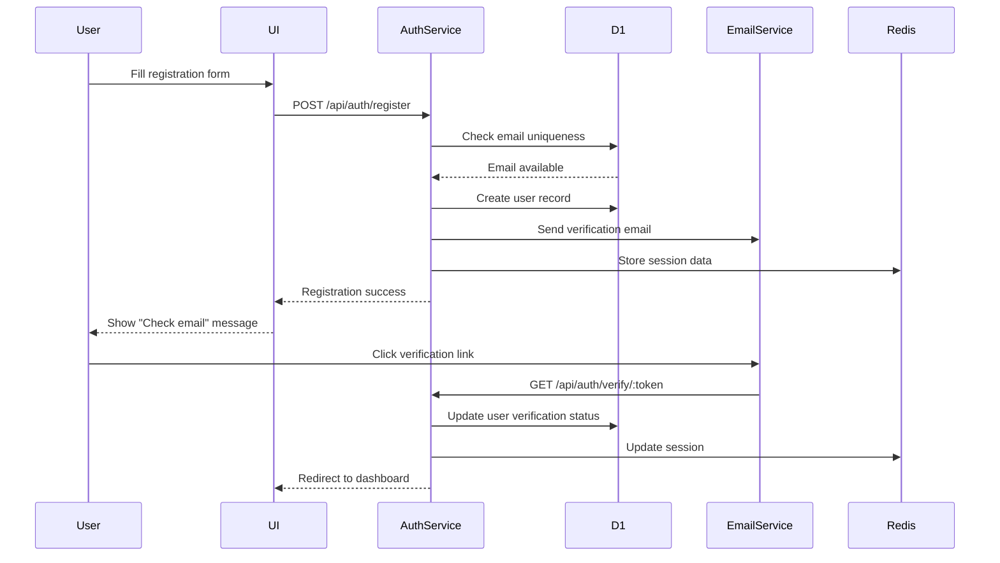

# Feature Specification: Authentication System

## Overview
- Feature ID: FEAT-001
- User Story References: US-001, US-002, US-003
- Priority: P1 (Critical)
- Estimated Tokens: 65k

## Visual Design Reference
- Figma Link: N/A (Business planning phase)
- Key Screens: Registration Form, Login Form, Email Verification, Password Reset
- Design Tokens: Modern SaaS patterns with clear CTAs and error states

## API Specification

### Endpoint: POST /api/auth/register
**Purpose:** User registration with email verification
**Authentication:** None required

**Request:**
```json
{
  "email": "user@example.com",
  "password": "SecurePass123!",
  "name": "John Doe",
  "timezone": "America/New_York",
  "language": "en",
  "gdprConsent": true,
  "subscriptionTier": "free"
}
```

**Response (201 Created):**
```json
{
  "success": true,
  "data": {
    "id": "550e8400-e29b-41d4-a716-446655440000",
    "email": "user@example.com",
    "name": "John Doe",
    "emailVerified": false,
    "subscriptionTier": "free",
    "createdAt": "2024-01-20T10:30:00Z"
  },
  "meta": {
    "timestamp": "2024-01-20T10:30:00Z",
    "version": "1.0.0",
    "requestId": "req_abc123"
  }
}
```

**Error Responses:**
- 400: Invalid input (email format, weak password, missing GDPR consent)
- 409: Email already exists
- 429: Rate limit exceeded (3 attempts per minute per IP)

### Endpoint: POST /api/auth/verify-email
**Purpose:** Email verification with secure token
**Authentication:** None required

**Request:**
```json
{
  "token": "eyJhbGciOiJIUzI1NiIsInR5cCI6IkpXVCJ9..."
}
```

**Response (200 OK):**
```json
{
  "success": true,
  "data": {
    "verified": true,
    "redirectUrl": "/onboarding"
  }
}
```

### Endpoint: POST /api/auth/login
**Purpose:** User authentication with JWT tokens
**Authentication:** None required

**Request:**
```json
{
  "email": "user@example.com",
  "password": "SecurePass123!",
  "rememberMe": true
}
```

**Response (200 OK):**
```json
{
  "success": true,
  "data": {
    "accessToken": "eyJhbGciOiJIUzI1NiIsInR5cCI6IkpXVCJ9...",
    "refreshToken": "eyJhbGciOiJIUzI1NiIsInR5cCI6IkpXVCJ9...",
    "expiresIn": 3600,
    "user": {
      "id": "550e8400-e29b-41d4-a716-446655440000",
      "email": "user@example.com",
      "name": "John Doe",
      "subscriptionTier": "free",
      "emailVerified": true
    }
  }
}
```

### Endpoint: POST /api/auth/refresh
**Purpose:** Refresh JWT access token
**Authentication:** Refresh token required

**Request:**
```json
{
  "refreshToken": "eyJhbGciOiJIUzI1NiIsInR5cCI6IkpXVCJ9..."
}
```

**Response (200 OK):**
```json
{
  "success": true,
  "data": {
    "accessToken": "eyJhbGciOiJIUzI1NiIsInR5cCI6IkpXVCJ9...",
    "expiresIn": 3600
  }
}
```

### Endpoint: POST /api/auth/forgot-password
**Purpose:** Password reset request
**Authentication:** None required

**Request:**
```json
{
  "email": "user@example.com"
}
```

**Response (200 OK):**
```json
{
  "success": true,
  "data": {
    "message": "If account exists, password reset email has been sent",
    "resetTokenExpiresIn": 86400
  }
}
```

### Endpoint: POST /api/auth/reset-password
**Purpose:** Complete password reset with token
**Authentication:** None required

**Request:**
```json
{
  "token": "reset_token_here",
  "newPassword": "NewSecurePass123!",
  "confirmPassword": "NewSecurePass123!"
}
```

**Response (200 OK):**
```json
{
  "success": true,
  "data": {
    "message": "Password reset successfully",
    "loginRequired": true
  }
}
```

## Component Specification

### Component: RegistrationForm
**Purpose:** User registration with validation and GDPR compliance
**Props:**
```typescript
interface RegistrationFormProps {
  onSuccess: (user: User) => void;
  onError: (error: ApiError) => void;
  initialEmail?: string;
  showGdprConsent: boolean;
}
```

**State Management:**
- Local state: formData, validation errors, loading state, password strength
- Global state: None (form is stateless)

**Events:**
- onSubmit: Validates form and calls registration API
- onPasswordChange: Updates password strength indicator
- onEmailBlur: Validates email format and availability

### Component: LoginForm
**Purpose:** User authentication with "Remember Me" option
**Props:**
```typescript
interface LoginFormProps {
  onSuccess: (tokens: AuthTokens, user: User) => void;
  onError: (error: ApiError) => void;
  onForgotPassword: () => void;
  redirectAfterLogin?: string;
}
```

**State Management:**
- Local state: credentials, loading, error state, failed attempts
- Global state: User authentication state via auth context

**Events:**
- onSubmit: Authenticates user and stores tokens
- onForgotPasswordClick: Navigates to password reset flow
- onTogglePasswordVisibility: Shows/hides password field

### Component: EmailVerificationBanner
**Purpose:** Persistent reminder for unverified users
**Props:**
```typescript
interface EmailVerificationBannerProps {
  user: User;
  onResendVerification: () => Promise<void>;
  onDismiss?: () => void;
}
```

**State Management:**
- Local state: resend cooldown timer, loading state
- Global state: User verification status

## Data Flow



## Library Documentation & Examples

### Required Libraries
```json
{
  "dependencies": {
    "@cloudflare/workers-types": "^4.20240925.0",
    "bcryptjs": "^2.4.3",
    "jsonwebtoken": "^9.0.2",
    "zod": "^3.22.4",
    "jose": "^5.1.3"
  },
  "devDependencies": {
    "wrangler": "^3.78.12",
    "@types/bcryptjs": "^2.4.6",
    "@types/jsonwebtoken": "^9.0.5"
  }
}
```

### Code Examples (from Cloudflare Docs)

#### Cloudflare Workers D1 Authentication
```typescript
// Source: Cloudflare Docs - D1 with Workers TypeScript patterns
export default {
  async fetch(request: Request, env: Env): Promise<Response> {
    const url = new URL(request.url);
    
    if (request.method === 'POST' && url.pathname === '/api/auth/register') {
      return handleRegistration(request, env);
    }
    
    return new Response('Not found', { status: 404 });
  }
};

async function handleRegistration(request: Request, env: Env): Promise<Response> {
  try {
    const body = await request.json() as RegistrationRequest;
    
    // Validate input using Zod
    const validatedData = registrationSchema.parse(body);
    
    // Check if email already exists - D1 prepared statement pattern
    const existingUser = await env.DB.prepare(
      'SELECT id FROM users WHERE email = ?'
    ).bind(validatedData.email).first();
    
    if (existingUser) {
      return Response.json(
        { success: false, error: 'Email already registered' },
        { status: 409 }
      );
    }
    
    // Hash password with bcrypt
    const passwordHash = await bcrypt.hash(validatedData.password, 12);
    
    // Generate verification token
    const verificationToken = crypto.randomUUID();
    
    // Insert new user - D1 prepared statement with transaction
    const userId = crypto.randomUUID();
    await env.DB.prepare(`
      INSERT INTO users (id, email, password_hash, name, timezone, language, 
                        verification_token, subscription_tier, created_at)
      VALUES (?, ?, ?, ?, ?, ?, ?, ?, ?)
    `).bind(
      userId,
      validatedData.email,
      passwordHash,
      validatedData.name,
      validatedData.timezone,
      validatedData.language,
      verificationToken,
      'free',
      new Date().toISOString()
    ).run();
    
    // Send verification email (implement with your email service)
    await sendVerificationEmail(validatedData.email, verificationToken, env);
    
    return Response.json({
      success: true,
      data: {
        id: userId,
        email: validatedData.email,
        name: validatedData.name,
        emailVerified: false,
        subscriptionTier: 'free',
        createdAt: new Date().toISOString()
      }
    }, { status: 201 });
    
  } catch (error) {
    console.error('Registration error:', error);
    return Response.json(
      { success: false, error: 'Registration failed' },
      { status: 500 }
    );
  }
}
```

#### JWT Token Management with Workers
```typescript
// Source: Cloudflare Docs - JWT handling in Workers
import { SignJWT, jwtVerify } from 'jose';

async function generateTokens(userId: string, env: Env) {
  const secret = new TextEncoder().encode(env.JWT_SECRET);
  
  // Access token (1 hour)
  const accessToken = await new SignJWT({ userId, type: 'access' })
    .setProtectedHeader({ alg: 'HS256' })
    .setIssuedAt()
    .setExpirationTime('1h')
    .sign(secret);
  
  // Refresh token (7 days)
  const refreshToken = await new SignJWT({ userId, type: 'refresh' })
    .setProtectedHeader({ alg: 'HS256' })
    .setIssuedAt()
    .setExpirationTime('7d')
    .sign(secret);
  
  return { accessToken, refreshToken };
}

async function verifyToken(token: string, env: Env) {
  try {
    const secret = new TextEncoder().encode(env.JWT_SECRET);
    const { payload } = await jwtVerify(token, secret);
    return payload;
  } catch (error) {
    throw new Error('Invalid token');
  }
}
```

#### Input Validation with Zod
```typescript
// Source: Current best practices - Zod validation patterns
import { z } from 'zod';

const registrationSchema = z.object({
  email: z.string().email('Invalid email format'),
  password: z.string()
    .min(8, 'Password must be at least 8 characters')
    .regex(/^(?=.*[a-z])(?=.*[A-Z])(?=.*\d)(?=.*[@$!%*?&])[A-Za-z\d@$!%*?&]$/,
           'Password must contain uppercase, lowercase, number, and special character'),
  name: z.string().min(1, 'Name is required').max(100, 'Name too long'),
  timezone: z.string().min(1, 'Timezone is required'),
  language: z.enum(['en', 'es', 'fr', 'de']).default('en'),
  gdprConsent: z.boolean().refine(val => val === true, 'GDPR consent required'),
  subscriptionTier: z.enum(['free', 'individual', 'professional', 'enterprise']).default('free')
});

const loginSchema = z.object({
  email: z.string().email('Invalid email format'),
  password: z.string().min(1, 'Password is required'),
  rememberMe: z.boolean().optional().default(false)
});
```

#### React Component with TypeScript (Next.js 14)
```typescript
// Source: Next.js 14 + TypeScript current patterns
'use client';

import { useState, useTransition } from 'react';
import { useRouter } from 'next/navigation';
import { useAuth } from '@/hooks/useAuth';

interface RegistrationFormData {
  email: string;
  password: string;
  name: string;
  timezone: string;
  language: string;
  gdprConsent: boolean;
}

export function RegistrationForm() {
  const [formData, setFormData] = useState<RegistrationFormData>({
    email: '',
    password: '',
    name: '',
    timezone: Intl.DateTimeFormat().resolvedOptions().timeZone,
    language: 'en',
    gdprConsent: false
  });
  
  const [errors, setErrors] = useState<Partial<RegistrationFormData>>({});
  const [isPending, startTransition] = useTransition();
  const { register } = useAuth();
  const router = useRouter();
  
  const handleSubmit = (e: React.FormEvent) => {
    e.preventDefault();
    
    startTransition(async () => {
      try {
        const result = await register(formData);
        if (result.success) {
          router.push('/verify-email');
        }
      } catch (error) {
        setErrors({ email: 'Registration failed' });
      }
    });
  };
  
  return (
    <form onSubmit={handleSubmit} className="space-y-6">
      <div>
        <label htmlFor="email" className="block text-sm font-medium">
          Email Address
        </label>
        <input
          type="email"
          id="email"
          value={formData.email}
          onChange={(e) => setFormData(prev => ({ ...prev, email: e.target.value }))}
          className="mt-1 block w-full rounded-md border border-gray-300 px-3 py-2"
          required
        />
        {errors.email && (
          <p className="mt-1 text-sm text-red-600">{errors.email}</p>
        )}
      </div>
      
      <div>
        <label htmlFor="password" className="block text-sm font-medium">
          Password
        </label>
        <input
          type="password"
          id="password"
          value={formData.password}
          onChange={(e) => setFormData(prev => ({ ...prev, password: e.target.value }))}
          className="mt-1 block w-full rounded-md border border-gray-300 px-3 py-2"
          required
        />
        <PasswordStrengthIndicator password={formData.password} />
      </div>
      
      <div className="flex items-center">
        <input
          type="checkbox"
          id="gdprConsent"
          checked={formData.gdprConsent}
          onChange={(e) => setFormData(prev => ({ ...prev, gdprConsent: e.target.checked }))}
          className="mr-2"
          required
        />
        <label htmlFor="gdprConsent" className="text-sm">
          I agree to the processing of my personal data in accordance with the Privacy Policy
        </label>
      </div>
      
      <button
        type="submit"
        disabled={isPending || !formData.gdprConsent}
        className="w-full bg-blue-600 text-white py-2 px-4 rounded-md hover:bg-blue-700 disabled:opacity-50"
      >
        {isPending ? 'Creating Account...' : 'Create Account'}
      </button>
    </form>
  );
}
```

### Important Implementation Notes

#### Security Requirements
- Use bcrypt with 12 salt rounds (updated from 10 in 2024 for better security)
- JWT tokens: 1-hour access tokens, 7-day refresh tokens
- Rate limiting: 3 registration attempts per minute per IP
- Account lockout: 5 failed login attempts = 15-minute lockout
- CSRF protection using SameSite cookies and CSRF tokens

#### D1 Database Patterns
```sql
-- Users table with proper indexes
CREATE TABLE users (
    id TEXT PRIMARY KEY,
    email TEXT UNIQUE NOT NULL,
    password_hash TEXT NOT NULL,
    name TEXT NOT NULL,
    timezone TEXT NOT NULL,
    language TEXT DEFAULT 'en',
    subscription_tier TEXT DEFAULT 'free',
    email_verified BOOLEAN DEFAULT FALSE,
    verification_token TEXT,
    reset_token TEXT,
    reset_expires DATETIME,
    failed_login_attempts INTEGER DEFAULT 0,
    locked_until DATETIME,
    created_at DATETIME DEFAULT CURRENT_TIMESTAMP,
    updated_at DATETIME DEFAULT CURRENT_TIMESTAMP,
    last_login DATETIME
);

CREATE INDEX idx_users_email ON users(email);
CREATE INDEX idx_users_verification_token ON users(verification_token) WHERE verification_token IS NOT NULL;
CREATE INDEX idx_users_reset_token ON users(reset_token) WHERE reset_token IS NOT NULL;
```

#### Email Service Integration
```typescript
// Email verification template
async function sendVerificationEmail(email: string, token: string, env: Env) {
  const verificationUrl = `${env.APP_URL}/verify-email?token=${token}`;
  
  const emailHtml = `
    <h1>Welcome to GPUScout!</h1>
    <p>Please click the button below to verify your email address:</p>
    <a href="${verificationUrl}" style="background: #0066cc; color: white; padding: 10px 20px; text-decoration: none; border-radius: 5px;">
      Verify Email
    </a>
    <p>This link expires in 24 hours.</p>
    <p>If you didn't create an account, you can safely ignore this email.</p>
  `;
  
  // Use your preferred email service (SendGrid, Mailgun, etc.)
  await sendEmail({
    to: email,
    subject: 'Verify your GPUScout account',
    html: emailHtml
  });
}
```

## Validation Rules
- **Email**: RFC 5322 compliant format, unique across system
- **Password**: 8+ characters, mixed case, numbers, special characters
- **Name**: 1-100 characters, no special validation
- **Timezone**: Valid IANA timezone identifier
- **Language**: Must be one of supported languages (en, es, fr, de)
- **GDPR Consent**: Required boolean true for EU users

## Error Handling
- Network errors: Retry with exponential backoff (3 attempts)
- Validation errors: Display inline with specific field guidance
- Server errors: Generic message with request ID for support
- Rate limiting: Clear countdown timer with retry guidance

## Registry Updates Required
- **endpoints.json**: Add all authentication endpoints (/register, /login, /verify, etc.)
- **components.json**: Register RegistrationForm, LoginForm, EmailVerificationBanner
- **schemas.json**: Add User, AuthTokens, RegistrationRequest data models

## Performance Requirements
- Registration: Complete within 3 seconds including email sending
- Login: Complete within 2 seconds with token generation
- Email verification: Process within 1 second with redirect
- Password reset: Email delivery within 5 minutes
- Token refresh: Complete within 500ms

## Security Considerations
- Store JWT secrets in Cloudflare Workers environment variables
- Use secure, httpOnly cookies for refresh tokens where possible
- Implement CSRF protection for state-changing operations
- Log all authentication events for security monitoring
- Use prepared statements for all database operations to prevent SQL injection
- Validate all inputs on both client and server side