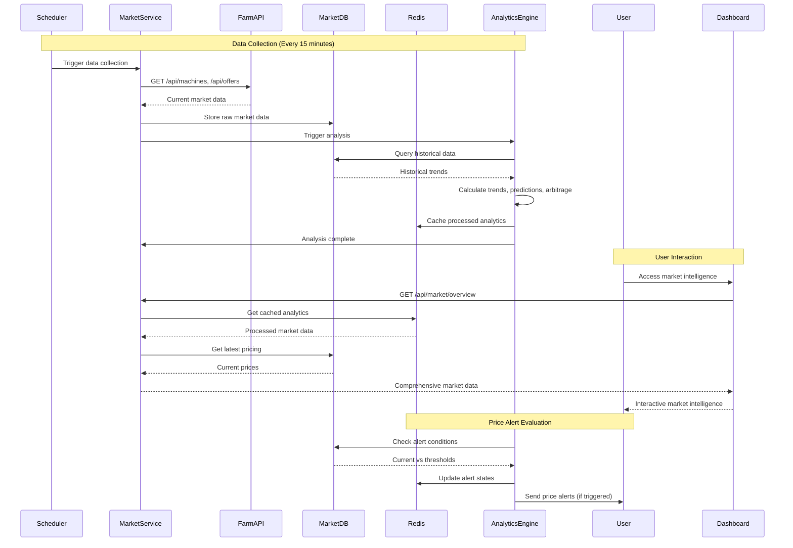

# Feature Specification: Market Intelligence & Pricing

## Overview
- Feature ID: FEAT-004
- User Story References: US-014, US-015, US-016, US-017, US-018
- Priority: P1 (Critical - Core Value Proposition)
- Estimated Tokens: 71k

## Visual Design Reference
- Figma Link: N/A (Business planning phase)
- Key Screens: Market Overview Dashboard, Pricing Comparison Table, Trend Analysis Charts, Competitive Positioning
- Design Tokens: Data-heavy interfaces with interactive charts, comparison tables, and real-time update indicators

## API Specification

### Endpoint: GET /api/market/overview
**Purpose:** Get comprehensive market overview with pricing trends and demand indicators
**Authentication:** JWT token required

**Request Query Parameters:**
```typescript
interface MarketOverviewQuery {
  gpuModels?: string[]; // Filter by specific GPU models
  timeRange?: '1h' | '6h' | '24h' | '7d' | '30d'; // Default '24h'
  region?: string; // Default 'global'
  includeHistorical?: boolean; // Default true
  includePredictions?: boolean; // Default false (premium feature)
}
```

**Response (200 OK):**
```json
{
  "success": true,
  "data": {
    "overview": {
      "totalActiveGPUs": 47823,
      "totalMonthlyVolume": 1247382.50,
      "averageUtilization": 78.4,
      "marketGrowth": {
        "daily": 0.023,
        "weekly": 0.089,
        "monthly": 0.156
      },
      "topPerformingModels": [
        "nvidia_rtx_4090",
        "nvidia_rtx_4080",
        "nvidia_a100_80gb"
      ],
      "emergingTrends": [
        {
          "trend": "ai_training_surge",
          "description": "34% increase in AI training demand over past 72 hours",
          "impact": "high",
          "affectedModels": ["nvidia_rtx_4090", "nvidia_a100_80gb"]
        }
      ]
    },
    "pricing": {
      "marketAverages": {
        "nvidia_rtx_4090": {
          "current": 2.89,
          "change24h": 0.12,
          "changePercent": 4.3,
          "volume": 8947,
          "activeProviders": 342
        },
        "nvidia_rtx_4080": {
          "current": 2.31,
          "change24h": 0.08,
          "changePercent": 3.6,
          "volume": 6234,
          "activeProviders": 287
        }
      },
      "priceRanges": {
        "nvidia_rtx_4090": {
          "min": 1.85,
          "max": 3.95,
          "p25": 2.45,
          "p50": 2.89,
          "p75": 3.25,
          "p90": 3.65
        }
      },
      "demandIndicators": {
        "nvidia_rtx_4090": {
          "demandLevel": "very_high",
          "queueTime": "< 5 minutes",
          "utilizationRate": 94.2,
          "bookingTrend": "increasing"
        }
      }
    },
    "regional": {
      "us_east": {
        "averageRate": 2.95,
        "demand": "high",
        "latency": "optimal"
      },
      "us_west": {
        "averageRate": 2.84,
        "demand": "very_high",
        "latency": "optimal"
      },
      "europe": {
        "averageRate": 3.12,
        "demand": "medium",
        "latency": "good"
      }
    },
    "predictions": {
      "nextHour": {
        "nvidia_rtx_4090": {
          "predictedRate": 2.94,
          "confidence": 0.87,
          "factors": ["weekend_premium", "ai_training_spike"]
        }
      },
      "next24h": {
        "nvidia_rtx_4090": {
          "predictedRange": [2.75, 3.15],
          "confidence": 0.79,
          "keyEvents": ["market_close_asia", "us_trading_hours"]
        }
      }
    },
    "competitiveIntelligence": {
      "topProviders": [
        {
          "name": "anonymous_provider_1",
          "marketShare": 0.034,
          "averageRate": 2.65,
          "uptime": 0.994,
          "specialization": "ai_training"
        }
      ],
      "marketConcentration": {
        "hhi": 0.087,
        "description": "Moderately competitive market"
      }
    },
    "lastUpdated": "2024-01-20T17:30:00Z",
    "nextUpdate": "2024-01-20T17:45:00Z",
    "dataQuality": {
      "completeness": 0.96,
      "freshness": 0.98,
      "accuracy": 0.94
    }
  }
}
```

**Error Responses:**
- 401: Unauthorized (invalid JWT token)
- 403: Forbidden (premium features require subscription upgrade)
- 429: Rate limit exceeded (30 requests per minute)
- 503: External data source unavailable

### Endpoint: GET /api/market/pricing-comparison
**Purpose:** Compare user's pricing against market benchmarks with positioning analysis
**Authentication:** JWT token required

**Request Query Parameters:**
```typescript
interface PricingComparisonQuery {
  portfolioId?: string; // Compare specific portfolio
  gpuModel: string; // Required GPU model to compare
  region?: string;
  timeRange?: '1h' | '6h' | '24h' | '7d' | '30d';
  includeRecommendations?: boolean; // Default true
}
```

**Response (200 OK):**
```json
{
  "success": true,
  "data": {
    "comparison": {
      "gpuModel": "nvidia_rtx_4090",
      "userPricing": {
        "currentRate": 2.50,
        "portfolioId": "portfolio_abc123-def456-ghi789",
        "lastUpdated": "2024-01-18T14:30:00Z"
      },
      "marketBenchmarks": {
        "average": 2.89,
        "median": 2.85,
        "percentiles": {
          "p10": 2.15,
          "p25": 2.45,
          "p50": 2.85,
          "p75": 3.25,
          "p90": 3.65,
          "p95": 3.85
        },
        "competitivePosition": {
          "percentile": 25,
          "description": "Below average - significant underpricing",
          "category": "budget_tier"
        }
      },
      "regionalComparison": {
        "us_east": {
          "average": 2.95,
          "yourPosition": "13th percentile",
          "gap": -0.45
        },
        "us_west": {
          "average": 2.84,
          "yourPosition": "18th percentile", 
          "gap": -0.34
        }
      },
      "similarProviders": [
        {
          "anonymousId": "provider_xyz",
          "rate": 2.48,
          "utilization": 89.3,
          "uptime": 0.987,
          "similarity": 0.94
        },
        {
          "anonymousId": "provider_abc", 
          "rate": 2.52,
          "utilization": 91.7,
          "uptime": 0.991,
          "similarity": 0.91
        }
      ],
      "priceElasticity": {
        "demandSensitivity": 0.73,
        "optimalRate": 2.78,
        "expectedUtilizationAtOptimal": 87.2,
        "revenueImpactAtOptimal": 0.147
      }
    },
    "recommendations": [
      {
        "id": "pricing_optimization_immediate",
        "type": "rate_increase",
        "priority": "high",
        "title": "Increase Rate to Market Average",
        "description": "Your current rate of $2.50 is 13.5% below market average. Increase to $2.75-$2.85 range.",
        "actions": [
          {
            "action": "set_rate",
            "newRate": 2.75,
            "expectedImpact": {
              "revenueIncrease": 0.10,
              "utilizationChange": -0.03,
              "confidence": 0.92
            }
          },
          {
            "action": "gradual_increase",
            "schedule": [
              {"rate": 2.60, "date": "2024-01-21T00:00:00Z"},
              {"rate": 2.70, "date": "2024-01-22T00:00:00Z"},
              {"rate": 2.75, "date": "2024-01-23T00:00:00Z"}
            ],
            "expectedImpact": {
              "revenueIncrease": 0.08,
              "utilizationChange": -0.02,
              "confidence": 0.95
            }
          }
        ],
        "confidence": 0.92,
        "timeframe": "immediate",
        "risk": "low"
      },
      {
        "id": "dynamic_pricing_implementation",
        "type": "strategy_change", 
        "priority": "medium",
        "title": "Implement Dynamic Pricing",
        "description": "Market shows 15-20% rate variation by time of day. Implement dynamic pricing for optimal revenue.",
        "actions": [
          {
            "action": "enable_dynamic_pricing",
            "peakHours": ["18:00-22:00", "06:00-09:00"],
            "peakMultiplier": 1.15,
            "offPeakMultiplier": 0.95,
            "expectedImpact": {
              "revenueIncrease": 0.12,
              "utilizationChange": -0.01,
              "confidence": 0.87
            }
          }
        ],
        "confidence": 0.87,
        "timeframe": "1-2 weeks",
        "risk": "medium"
      }
    ],
    "historicalAnalysis": {
      "priceHistory": [
        {"date": "2024-01-13", "userRate": 2.50, "marketAvg": 2.67},
        {"date": "2024-01-14", "userRate": 2.50, "marketAvg": 2.71},
        {"date": "2024-01-15", "userRate": 2.50, "marketAvg": 2.75}
      ],
      "missedRevenue": {
        "last7Days": 287.40,
        "last30Days": 1156.80,
        "yearlyProjection": 4627.20
      },
      "competitiveGaps": {
        "widening": true,
        "avgGapIncrease": 0.023,
        "trendDuration": "14 days"
      }
    },
    "lastUpdated": "2024-01-20T17:30:00Z"
  }
}
```

### Endpoint: GET /api/market/trends
**Purpose:** Get detailed market trend analysis with predictive insights
**Authentication:** JWT token required

**Request Query Parameters:**
```typescript
interface TrendAnalysisQuery {
  gpuModels?: string[];
  timeRange: '7d' | '30d' | '90d' | '1y';
  trendTypes?: ('pricing' | 'demand' | 'utilization' | 'revenue')[];
  includeSeasonality?: boolean;
  includePredictions?: boolean; // Premium feature
}
```

**Response (200 OK):**
```json
{
  "success": true,
  "data": {
    "trends": {
      "nvidia_rtx_4090": {
        "pricing": {
          "trend": "upward",
          "strength": 0.73,
          "slope": 0.0125,
          "significance": 0.94,
          "keyInflectionPoints": [
            {
              "date": "2024-01-15T00:00:00Z",
              "event": "ai_training_demand_surge",
              "impact": 0.089
            }
          ],
          "seasonalFactors": {
            "weekdayPremium": 1.08,
            "weekendPremium": 1.12,
            "monthlyPattern": [1.0, 0.97, 1.03, 1.05, 1.02, 0.98, 0.95, 0.94, 1.01, 1.06, 1.09, 1.11]
          }
        },
        "demand": {
          "trend": "strong_upward",
          "strength": 0.87,
          "indicators": {
            "queueTime": {
              "current": "< 5 minutes",
              "trend": "decreasing",
              "strength": 0.82
            },
            "utilizationRate": {
              "current": 94.2,
              "trend": "increasing",
              "strength": 0.91
            },
            "newProviderGrowth": {
              "weeklyGrowth": 0.034,
              "trend": "accelerating"
            }
          }
        },
        "correlation": {
          "priceVsDemand": 0.78,
          "priceVsUtilization": 0.82,
          "demandVsNewProviders": -0.34
        }
      }
    },
    "marketEvents": [
      {
        "date": "2024-01-15T00:00:00Z",
        "type": "demand_surge",
        "title": "AI Training Boom",
        "description": "Major AI companies increased GPU compute spending by 40%",
        "impact": {
          "priceIncrease": 0.089,
          "demandIncrease": 0.34,
          "duration": "ongoing"
        },
        "affectedModels": ["nvidia_rtx_4090", "nvidia_a100_80gb", "nvidia_h100"]
      },
      {
        "date": "2024-01-10T00:00:00Z", 
        "type": "supply_constraint",
        "title": "Datacenter Capacity Shortage",
        "description": "Limited datacenter power availability in key regions",
        "impact": {
          "priceIncrease": 0.045,
          "supplyDecrease": 0.12,
          "duration": "2-3 months"
        },
        "affectedRegions": ["us_east", "europe"]
      }
    ],
    "predictions": {
      "next7Days": {
        "nvidia_rtx_4090": {
          "pricingRange": [2.75, 3.15],
          "mostLikelyPrice": 2.94,
          "confidence": 0.79,
          "keyFactors": [
            "continued_ai_demand",
            "weekend_premiums",
            "new_provider_onboarding"
          ]
        }
      },
      "next30Days": {
        "nvidia_rtx_4090": {
          "pricingRange": [2.65, 3.35],
          "mostLikelyPrice": 2.98,
          "confidence": 0.67,
          "scenario": {
            "bullish": {
              "price": 3.25,
              "probability": 0.25,
              "triggers": ["supply_shortage", "demand_acceleration"]
            },
            "neutral": {
              "price": 2.95,
              "probability": 0.50,
              "triggers": ["stable_demand", "normal_supply"]
            },
            "bearish": {
              "price": 2.70,
              "probability": 0.25,
              "triggers": ["demand_normalization", "new_capacity"]
            }
          }
        }
      }
    },
    "technicalIndicators": {
      "nvidia_rtx_4090": {
        "rsi": 67.3,
        "macd": {
          "signal": 0.023,
          "histogram": 0.015,
          "trend": "bullish"
        },
        "movingAverages": {
          "sma7": 2.87,
          "sma30": 2.71,
          "ema7": 2.89,
          "ema30": 2.74
        },
        "volatility": {
          "daily": 0.087,
          "weekly": 0.134,
          "annualized": 0.312
        }
      }
    },
    "competitiveLandscape": {
      "marketConcentration": {
        "hhi": 0.087,
        "trend": "decreasing",
        "newEntrants": {
          "monthly": 45,
          "retentionRate": 0.73
        }
      },
      "pricingStrategies": {
        "fixedPricing": 0.67,
        "dynamicPricing": 0.23,
        "demandBasedPricing": 0.10
      }
    },
    "lastUpdated": "2024-01-20T17:30:00Z"
  }
}
```

### Endpoint: GET /api/market/arbitrage-opportunities
**Purpose:** Identify cross-platform and temporal arbitrage opportunities
**Authentication:** JWT token required, premium feature

**Request Query Parameters:**
```typescript
interface ArbitrageQuery {
  minProfitMargin?: number; // Default 0.15 (15%)
  maxRisk?: 'low' | 'medium' | 'high'; // Default 'medium'
  timeHorizon?: '1h' | '6h' | '24h' | '7d'; // Default '24h'
  userPortfolios?: string[]; // Filter by user's GPU capabilities
}
```

**Response (200 OK):**
```json
{
  "success": true,
  "data": {
    "opportunities": [
      {
        "id": "arbitrage_runpod_lambda_rtx4090",
        "type": "cross_platform",
        "title": "RunPod → Lambda Labs Price Gap",
        "description": "RTX 4090 pricing gap of $0.34/hour between platforms",
        "details": {
          "sourceplatform": "runpod",
          "targetPlatform": "lambdalabs",
          "gpuModel": "nvidia_rtx_4090",
          "priceGap": 0.34,
          "profitMargin": 0.136,
          "volume": "medium",
          "duration": "6-12 hours"
        },
        "requirements": {
          "minCapital": 1500,
          "technicalComplexity": "medium",
          "automationSupport": true
        },
        "risks": [
          {
            "type": "execution_risk",
            "description": "Platform availability mismatch",
            "probability": 0.15,
            "impact": "medium"
          },
          {
            "type": "price_convergence",
            "description": "Gap may close quickly",
            "probability": 0.25,
            "impact": "high"
          }
        ],
        "implementation": {
          "estimatedSetupTime": "2-4 hours",
          "automationOptions": ["zapier", "custom_api"],
          "monitoringRequired": true
        },
        "profitability": {
          "hourlyProfit": 85.50,
          "dailyProfit": 2052.00,
          "roi": 0.137,
          "breakeven": "18 hours"
        },
        "confidence": 0.78,
        "priority": "high",
        "expiresAt": "2024-01-21T02:00:00Z"
      },
      {
        "id": "arbitrage_temporal_weekend_premium",
        "type": "temporal",
        "title": "Weekend Premium Opportunity",
        "description": "15-20% rate increase opportunity for weekend AI training jobs",
        "details": {
          "gpuModel": "nvidia_rtx_4090",
          "currentRate": 2.50,
          "weekendOptimalRate": 2.95,
          "demandIncrease": 0.23,
          "competitionDecrease": 0.08
        },
        "schedule": {
          "startTime": "2024-01-20T18:00:00Z",
          "endTime": "2024-01-21T23:59:59Z",
          "peakHours": ["09:00-17:00", "20:00-24:00"]
        },
        "profitability": {
          "weekendProfit": 432.00,
          "utilizationImpact": -0.05,
          "netBenefit": 387.60
        },
        "implementation": {
          "automationAvailable": true,
          "setupTime": "15 minutes",
          "riskLevel": "low"
        },
        "confidence": 0.91,
        "priority": "medium"
      }
    ],
    "summary": {
      "totalOpportunities": 7,
      "highPriority": 2,
      "mediumPriority": 3,
      "lowPriority": 2,
      "totalPotentialProfit": 3247.80,
      "averageConfidence": 0.84,
      "implementationComplexity": "medium"
    },
    "marketInsights": {
      "arbitrageFrequency": "3-5 opportunities per day",
      "averageDuration": "4.7 hours",
      "successRate": 0.73,
      "seasonalPatterns": {
        "weekends": "15-20% premium opportunities",
        "monthEnd": "10-15% increased demand",
        "holidays": "Variable, 20-40% premiums possible"
      }
    },
    "lastUpdated": "2024-01-20T17:30:00Z"
  }
}
```

### Endpoint: POST /api/market/price-alerts
**Purpose:** Create price-based alerts and monitoring rules
**Authentication:** JWT token required

**Request:**
```json
{
  "name": "RTX 4090 Price Drop Alert",
  "description": "Alert when RTX 4090 market average drops below $2.75",
  "conditions": {
    "gpuModel": "nvidia_rtx_4090",
    "metric": "market_average_price",
    "operator": "less_than",
    "threshold": 2.75,
    "duration": "15_minutes" 
  },
  "actions": [
    {
      "type": "notification",
      "channels": ["email", "discord"],
      "template": "price_drop_opportunity"
    },
    {
      "type": "auto_adjust_pricing",
      "portfolioId": "portfolio_abc123-def456-ghi789",
      "adjustment": "match_market_minus_5_percent",
      "maxDecrease": 0.10
    }
  ],
  "schedule": {
    "enabled": true,
    "activeHours": ["06:00-23:00"],
    "timezone": "America/New_York",
    "pauseDurations": []
  },
  "metadata": {
    "priority": "high",
    "tags": ["pricing", "opportunity", "automation"],
    "expirationDate": "2024-04-20T00:00:00Z"
  }
}
```

**Response (201 Created):**
```json
{
  "success": true,
  "data": {
    "alertId": "alert_price_abc123-def456-ghi789",
    "name": "RTX 4090 Price Drop Alert", 
    "status": "active",
    "estimatedTriggerFrequency": "2-3 times per week",
    "nextEvaluation": "2024-01-20T17:45:00Z",
    "testResult": {
      "wouldTrigger": false,
      "currentValue": 2.89,
      "thresholdDistance": 0.14
    },
    "createdAt": "2024-01-20T17:30:00Z"
  }
}
```

## Component Specification

### Component: MarketOverviewDashboard
**Purpose:** Comprehensive market intelligence hub with real-time data and trend analysis
**Props:**
```typescript
interface MarketOverviewDashboardProps {
  timeRange: '1h' | '6h' | '24h' | '7d' | '30d';
  onTimeRangeChange: (range: string) => void;
  selectedModels: string[];
  onModelSelectionChange: (models: string[]) => void;
  refreshInterval?: number; // Default 5 minutes
}

interface MarketData {
  overview: MarketOverview;
  pricing: PricingData;
  trends: TrendData;
  predictions: PredictionData;
  lastUpdated: string;
  dataQuality: DataQuality;
}
```

**State Management:**
- Local state: filter selections, chart zoom levels, view preferences, loading states
- Global state: Market data cache, user portfolio context, subscription tier

**Events:**
- onRefreshData: Manual data refresh with loading indicator
- onFilterChange: Update GPU model and region filters
- onChartInteraction: Zoom, pan, tooltip interactions on pricing charts
- onTrendAnalysis: Deep dive into specific trend patterns
- onAlertCreate: Create price-based alerts from chart data points

### Component: PricingComparisonTable
**Purpose:** Side-by-side comparison of user pricing vs market benchmarks with recommendations
**Props:**
```typescript
interface PricingComparisonTableProps {
  portfolioId?: string;
  gpuModels?: string[]; // If not provided, uses all user's GPU models
  showRecommendations?: boolean; // Default true
  onPriceUpdate: (gpuId: string, newRate: number) => Promise<void>;
  onRecommendationAccept: (recommendation: PricingRecommendation) => void;
}

interface PricingComparison {
  gpuModel: string;
  userPricing: UserPricingInfo;
  marketBenchmarks: MarketBenchmarks;
  competitivePosition: CompetitivePosition;
  recommendations: PricingRecommendation[];
}
```

**State Management:**
- Local state: sorting options, expanded rows, edit mode for pricing
- Global state: Real-time market data, user portfolio pricing, personalized recommendations

**Events:**
- onSort: Sort table by various metrics (gap, percentile, revenue impact)
- onExpandDetails: Show detailed market analysis for specific GPU model
- onQuickAdjust: One-click pricing adjustments to market benchmarks
- onBulkUpdate: Apply pricing strategy across multiple GPUs simultaneously
- onScheduleUpdate: Schedule gradual pricing changes over time

### Component: TrendAnalysisChart
**Purpose:** Interactive chart showing market trends with predictive overlays and technical indicators
**Props:**
```typescript
interface TrendAnalysisChartProps {
  gpuModel: string;
  timeRange: '7d' | '30d' | '90d' | '1y';
  metrics: ('pricing' | 'demand' | 'utilization' | 'volume')[];
  showPredictions?: boolean; // Premium feature
  showTechnicalIndicators?: boolean;
  onPeriodSelect?: (start: Date, end: Date) => void;
}

interface TrendData {
  historical: TimeSeriesData[];
  predictions: PredictionData[];
  events: MarketEvent[];
  technicalIndicators: TechnicalIndicators;
  seasonalFactors: SeasonalPattern[];
}
```

**State Management:**
- Local state: chart zoom level, selected time period, overlay selections
- Global state: Historical market data, prediction models, event annotations

**Events:**
- onZoom: Zoom into specific time periods for detailed analysis
- onEventHover: Show market event details on chart hover
- onPredictionToggle: Show/hide predictive overlays
- onIndicatorToggle: Toggle technical analysis indicators
- onExport: Export chart data and analysis to various formats

### Component: ArbitrageOpportunityCard
**Purpose:** Display actionable arbitrage opportunities with risk assessment and automation options
**Props:**
```typescript
interface ArbitrageOpportunityCardProps {
  opportunity: ArbitrageOpportunity;
  userCapabilities: UserCapabilities; // GPU models, platforms, capital
  onImplement: (opportunity: ArbitrageOpportunity, options: ImplementationOptions) => void;
  onDismiss: (opportunity: ArbitrageOpportunity, reason: string) => void;
  onSetupAlert: (opportunity: ArbitrageOpportunity) => void;
}

interface ArbitrageOpportunity {
  id: string;
  type: 'cross_platform' | 'temporal' | 'geographic' | 'demand_based';
  title: string;
  description: string;
  profitability: ProfitabilityMetrics;
  risks: RiskFactor[];
  implementation: ImplementationGuide;
  confidence: number;
  priority: 'high' | 'medium' | 'low';
  expiresAt: string;
}
```

**State Management:**
- Local state: expanded details, implementation progress, risk acknowledgment
- Global state: User portfolio capabilities, automation preferences, risk tolerance

**Events:**
- onExpand: Show detailed opportunity analysis and implementation guide
- onRiskToggle: Show/hide detailed risk assessment
- onAutomateSetup: Configure automated opportunity monitoring
- onSimilarOpportunities: Find similar arbitrage patterns
- onProfitCalculator: Open profit/loss calculator with user's specific parameters

### Component: CompetitiveIntelligencePanel
**Purpose:** Anonymous competitive landscape analysis with market positioning insights
**Props:**
```typescript
interface CompetitiveIntelligencePanelProps {
  userPortfolioId: string;
  gpuModel: string;
  showSimilarProviders?: boolean; // Default true
  anonymizationLevel: 'full' | 'partial'; // Based on subscription tier
}

interface CompetitiveData {
  marketPosition: MarketPosition;
  similarProviders: AnonymousProvider[];
  marketConcentration: ConcentrationMetrics;
  pricingStrategies: StrategyDistribution;
  benchmarkMetrics: BenchmarkComparison;
}
```

**State Management:**
- Local state: analysis depth, comparison criteria, visualization preferences
- Global state: Competitive intelligence data, user privacy settings, subscription features

**Events:**
- onBenchmarkSelect: Choose different competitive benchmarking criteria
- onPositionAnalysis: Deep dive into market positioning strengths/weaknesses
- onStrategyComparison: Compare user's strategy against market leaders
- onAnonymousInquiry: Request additional competitive intelligence (premium feature)

## Data Flow



## Library Documentation & Examples

### Required Libraries
```json
{
  "dependencies": {
    "axios": "^1.6.5",
    "node-cron": "^3.0.3",
    "redis": "^4.6.12",
    "d3": "^7.8.5",
    "recharts": "^2.10.3",
    "simple-statistics": "^7.8.3",
    "technical-indicators": "^3.1.0",
    "ml-regression": "^6.0.1"
  },
  "devDependencies": {
    "@types/d3": "^7.4.3",
    "@types/node-cron": "^3.0.11"
  }
}
```

### Code Examples (from Cloudflare Docs)

#### Market Data Collection Service
```typescript
// Source: Cloudflare Workers scheduled events pattern
export default {
  async scheduled(event: ScheduledEvent, env: Env, ctx: ExecutionContext): Promise<void> {
    // Market data collection every 15 minutes
    ctx.waitUntil(collectMarketData(env));
  },

  async fetch(request: Request, env: Env): Promise<Response> {
    const url = new URL(request.url);
    
    if (url.pathname === '/api/market/overview') {
      return handleMarketOverview(request, env);
    }
    
    return new Response('Not found', { status: 404 });
  }
};

async function collectMarketData(env: Env): Promise<void> {
  try {
    console.log('Starting market data collection at', new Date().toISOString());
    
    // Collect data from 500.farm API
    const farmData = await collect500FarmData(env);
    
    // Store raw data with timestamp
    await storeRawMarketData(farmData, env);
    
    // Trigger analytics processing
    await processMarketAnalytics(farmData, env);
    
    // Update competitive benchmarks
    await updateCompetitiveBenchmarks(env);
    
    console.log('Market data collection completed successfully');
    
  } catch (error) {
    console.error('Market data collection failed:', error);
    
    // Store error for monitoring
    await env.DB.prepare(`
      INSERT INTO market_data_errors (timestamp, error_type, error_message, stack_trace)
      VALUES (?, ?, ?, ?)
    `).bind(
      new Date().toISOString(),
      'collection_failure',
      error.message,
      error.stack
    ).run();
  }
}

async function collect500FarmData(env: Env): Promise<MarketDataCollection> {
  const endpoints = [
    '/api/v0/metrics', 
    '/api/v0/offers',
    '/api/v0/machines',
    '/api/v0/hosts',
    '/api/v0/gpu-stats'
  ];
  
  const dataCollection: MarketDataCollection = {
    timestamp: new Date().toISOString(),
    metrics: null,
    offers: null,
    machines: null,
    hosts: null,
    gpuStats: null
  };
  
  // Collect data from all endpoints in parallel
  const requests = endpoints.map(async (endpoint) => {
    try {
      const response = await fetch(`https://500.farm/vastai-exporter${endpoint}`, {
        headers: {
          'User-Agent': 'GPUScout-Analytics/1.0',
          'Accept': 'application/json'
        },
        cf: {
          cacheTtl: 60, // Cache for 1 minute
          cacheEverything: true
        }
      });
      
      if (!response.ok) {
        throw new Error(`HTTP ${response.status}: ${response.statusText}`);
      }
      
      const data = await response.json();
      const endpointName = endpoint.split('/').pop();
      
      // Store endpoint-specific data
      switch (endpointName) {
        case 'metrics':
          dataCollection.metrics = data;
          break;
        case 'offers':
          dataCollection.offers = data;
          break;
        case 'machines':
          dataCollection.machines = data;
          break;
        case 'hosts':
          dataCollection.hosts = data;
          break;
        case 'gpu-stats':
          dataCollection.gpuStats = data;
          break;
      }
      
      return { endpoint, success: true, data };
      
    } catch (error) {
      console.error(`Failed to collect from ${endpoint}:`, error);
      return { endpoint, success: false, error: error.message };
    }
  });
  
  const results = await Promise.all(requests);
  
  // Log collection results
  const successful = results.filter(r => r.success).length;
  console.log(`Market data collection: ${successful}/${endpoints.length} endpoints successful`);
  
  return dataCollection;
}

async function processMarketAnalytics(rawData: MarketDataCollection, env: Env): Promise<void> {
  // Extract pricing data from offers
  const pricingData = extractPricingData(rawData.offers);
  
  // Calculate market averages and percentiles
  const marketStats = calculateMarketStatistics(pricingData);
  
  // Detect trends and anomalies
  const trendAnalysis = await analyzeTrends(marketStats, env);
  
  // Generate competitive intelligence
  const competitiveData = analyzeCompetitiveLandscape(pricingData);
  
  // Store processed analytics
  await storeProcessedAnalytics({
    timestamp: rawData.timestamp,
    marketStats,
    trendAnalysis,
    competitiveData
  }, env);
  
  // Update cache for fast API responses
  await updateAnalyticsCache(marketStats, trendAnalysis, competitiveData, env);
  
  // Check for arbitrage opportunities
  await detectArbitrageOpportunities(marketStats, env);
}

function extractPricingData(offersData: any[]): GPUPricingData[] {
  if (!offersData || !Array.isArray(offersData)) {
    return [];
  }
  
  return offersData
    .filter(offer => offer.gpu_name && offer.dph_total && offer.reliability > 0.8)
    .map(offer => ({
      gpuModel: normalizeGPUName(offer.gpu_name),
      hourlyRate: parseFloat(offer.dph_total),
      region: offer.geolocation || 'unknown',
      availability: offer.num_gpus || 1,
      utilization: offer.utilization || 0,
      reliability: offer.reliability || 0,
      provider: anonymizeProvider(offer.id),
      timestamp: new Date().toISOString(),
      metadata: {
        totalFlops: offer.total_flops,
        cudaCores: offer.cuda_max_good,
        memory: offer.gpu_ram,
        pcieBandwidth: offer.pcie_bw
      }
    }))
    .filter(data => 
      data.hourlyRate > 0.01 && 
      data.hourlyRate < 50 && // Filter out obvious outliers
      data.gpuModel !== 'unknown'
    );
}

function calculateMarketStatistics(pricingData: GPUPricingData[]): MarketStatistics {
  const gpuGroups = groupBy(pricingData, 'gpuModel');
  const statistics: MarketStatistics = {};
  
  for (const [gpuModel, prices] of Object.entries(gpuGroups)) {
    const rates = prices.map(p => p.hourlyRate).sort((a, b) => a - b);
    
    if (rates.length < 5) continue; // Need minimum data points
    
    statistics[gpuModel] = {
      count: rates.length,
      average: calculateMean(rates),
      median: calculateMedian(rates),
      min: Math.min(...rates),
      max: Math.max(...rates),
      percentiles: {
        p10: calculatePercentile(rates, 0.10),
        p25: calculatePercentile(rates, 0.25),
        p75: calculatePercentile(rates, 0.75),
        p90: calculatePercentile(rates, 0.90),
        p95: calculatePercentile(rates, 0.95)
      },
      standardDeviation: calculateStandardDeviation(rates),
      volume: rates.length,
      activeProviders: new Set(prices.map(p => p.provider)).size,
      averageUtilization: calculateMean(prices.map(p => p.utilization)),
      regionBreakdown: calculateRegionalBreakdown(prices)
    };
  }
  
  return statistics;
}

async function analyzeTrends(currentStats: MarketStatistics, env: Env): Promise<TrendAnalysis> {
  // Get historical data for trend calculation
  const historicalData = await env.DB.prepare(`
    SELECT gpu_model, average_rate, timestamp
    FROM market_statistics 
    WHERE timestamp > datetime('now', '-30 days')
    ORDER BY gpu_model, timestamp
  `).all();
  
  const trendAnalysis: TrendAnalysis = {};
  
  for (const gpuModel of Object.keys(currentStats)) {
    const historicalRates = historicalData.results
      .filter((row: any) => row.gpu_model === gpuModel)
      .map((row: any) => ({
        rate: row.average_rate,
        timestamp: row.timestamp
      }));
    
    if (historicalRates.length < 7) continue; // Need at least a week of data
    
    // Calculate trend strength and direction
    const rates = historicalRates.map(h => h.rate);
    const trendStrength = calculateTrendStrength(rates);
    const priceChange24h = rates[rates.length - 1] - rates[rates.length - 2];
    const priceChange7d = rates[rates.length - 1] - rates[Math.max(0, rates.length - 7)];
    
    trendAnalysis[gpuModel] = {
      trend: trendStrength > 0.1 ? 'upward' : trendStrength < -0.1 ? 'downward' : 'sideways',
      strength: Math.abs(trendStrength),
      priceChange24h,
      priceChange7d,
      volatility: calculateVolatility(rates),
      momentum: calculateMomentum(rates),
      support: calculateSupportLevel(rates),
      resistance: calculateResistanceLevel(rates)
    };
  }
  
  return trendAnalysis;
}

async function detectArbitrageOpportunities(marketStats: MarketStatistics, env: Env): Promise<void> {
  const opportunities: ArbitrageOpportunity[] = [];
  
  // Cross-platform arbitrage detection
  for (const [gpuModel, stats] of Object.entries(marketStats)) {
    if (stats.regionBreakdown && Object.keys(stats.regionBreakdown).length > 1) {
      const regions = Object.entries(stats.regionBreakdown);
      
      // Find significant price gaps between regions
      for (let i = 0; i < regions.length; i++) {
        for (let j = i + 1; j < regions.length; j++) {
          const [region1, data1] = regions[i];
          const [region2, data2] = regions[j];
          
          const priceGap = Math.abs(data1.averageRate - data2.averageRate);
          const profitMargin = priceGap / Math.min(data1.averageRate, data2.averageRate);
          
          if (profitMargin > 0.15) { // 15% minimum arbitrage opportunity
            opportunities.push({
              id: `arbitrage_${gpuModel}_${region1}_${region2}_${Date.now()}`,
              type: 'geographic',
              gpuModel,
              sourceRegion: data1.averageRate > data2.averageRate ? region2 : region1,
              targetRegion: data1.averageRate > data2.averageRate ? region1 : region2,
              priceGap,
              profitMargin,
              confidence: calculateArbitrageConfidence(data1, data2),
              estimatedDuration: estimateArbitrageDuration(profitMargin),
              detectedAt: new Date().toISOString()
            });
          }
        }
      }
    }
  }
  
  // Store opportunities for user alerts
  for (const opportunity of opportunities) {
    await env.DB.prepare(`
      INSERT INTO arbitrage_opportunities (
        id, type, gpu_model, source_region, target_region,
        price_gap, profit_margin, confidence, detected_at, expires_at
      ) VALUES (?, ?, ?, ?, ?, ?, ?, ?, ?, ?)
    `).bind(
      opportunity.id,
      opportunity.type,
      opportunity.gpuModel,
      opportunity.sourceRegion,
      opportunity.targetRegion,
      opportunity.priceGap,
      opportunity.profitMargin,
      opportunity.confidence,
      opportunity.detectedAt,
      new Date(Date.now() + 24 * 60 * 60 * 1000).toISOString() // 24 hour expiry
    ).run();
  }
  
  console.log(`Detected ${opportunities.length} arbitrage opportunities`);
}
```

#### Real-Time Market Intelligence API
```typescript
// Source: Cloudflare Workers with D1 and Redis integration
async function handleMarketOverview(request: Request, env: Env): Promise<Response> {
  try {
    const url = new URL(request.url);
    const gpuModels = url.searchParams.get('gpuModels')?.split(',') || [];
    const timeRange = url.searchParams.get('timeRange') || '24h';
    const region = url.searchParams.get('region') || 'global';
    const includeHistorical = url.searchParams.get('includeHistorical') === 'true';
    const includePredictions = url.searchParams.get('includePredictions') === 'true';
    
    // Check cache first for fast response
    const cacheKey = `market_overview:${gpuModels.join(',')}:${timeRange}:${region}`;
    const cached = await env.REDIS.get(cacheKey);
    
    if (cached) {
      const cachedData = JSON.parse(cached);
      // Check if cache is fresh (< 5 minutes old)
      if (Date.now() - new Date(cachedData.timestamp).getTime() < 5 * 60 * 1000) {
        return Response.json({
          success: true,
          data: cachedData,
          cached: true
        });
      }
    }
    
    // Build market overview from latest data
    const overview = await buildMarketOverview(gpuModels, timeRange, region, env);
    const pricing = await buildPricingData(gpuModels, region, env);
    const trends = includeHistorical ? await buildTrendData(gpuModels, timeRange, env) : null;
    const predictions = includePredictions ? await buildPredictions(gpuModels, env) : null;
    
    const marketData = {
      overview,
      pricing,
      trends,
      predictions,
      regional: await buildRegionalData(gpuModels, env),
      competitiveIntelligence: await buildCompetitiveIntelligence(gpuModels, env),
      lastUpdated: new Date().toISOString(),
      nextUpdate: new Date(Date.now() + 15 * 60 * 1000).toISOString(), // 15 minutes
      dataQuality: await assessDataQuality(env)
    };
    
    // Cache the response for 5 minutes
    await env.REDIS.setex(cacheKey, 300, JSON.stringify(marketData));
    
    return Response.json({
      success: true,
      data: marketData
    });
    
  } catch (error) {
    console.error('Market overview API error:', error);
    
    return Response.json({
      success: false,
      error: 'Failed to retrieve market data',
      timestamp: new Date().toISOString()
    }, { status: 500 });
  }
}

async function buildMarketOverview(
  gpuModels: string[], 
  timeRange: string, 
  region: string, 
  env: Env
): Promise<MarketOverview> {
  // Get total market statistics
  const totalStats = await env.DB.prepare(`
    SELECT 
      COUNT(DISTINCT gpu_model) as total_models,
      SUM(active_gpus) as total_active_gpus,
      SUM(monthly_volume) as total_monthly_volume,
      AVG(utilization) as average_utilization,
      COUNT(DISTINCT provider_id) as total_providers
    FROM market_statistics 
    WHERE timestamp > datetime('now', '-${timeRange}')
    ${region !== 'global' ? 'AND region = ?' : ''}
  `);
  
  const params = region !== 'global' ? [region] : [];
  const stats = await totalStats.bind(...params).first();
  
  // Get growth metrics
  const growthMetrics = await calculateGrowthMetrics(timeRange, region, env);
  
  // Get top performing models
  const topModels = await env.DB.prepare(`
    SELECT gpu_model, AVG(average_rate) as avg_rate, SUM(volume) as total_volume
    FROM market_statistics 
    WHERE timestamp > datetime('now', '-24h')
    ${region !== 'global' ? 'AND region = ?' : ''}
    GROUP BY gpu_model
    ORDER BY total_volume DESC
    LIMIT 5
  `).bind(...params).all();
  
  // Detect emerging trends
  const emergingTrends = await detectEmergingTrends(timeRange, region, env);
  
  return {
    totalActiveGPUs: stats.total_active_gpus || 0,
    totalMonthlyVolume: stats.total_monthly_volume || 0,
    averageUtilization: stats.average_utilization || 0,
    totalProviders: stats.total_providers || 0,
    marketGrowth: growthMetrics,
    topPerformingModels: topModels.results.map((row: any) => row.gpu_model),
    emergingTrends
  };
}

async function buildPricingData(
  gpuModels: string[], 
  region: string, 
  env: Env
): Promise<PricingData> {
  const pricing: PricingData = {
    marketAverages: {},
    priceRanges: {},
    demandIndicators: {}
  };
  
  // If no specific models requested, get all popular models
  const modelsToQuery = gpuModels.length > 0 
    ? gpuModels 
    : ['nvidia_rtx_4090', 'nvidia_rtx_4080', 'nvidia_a100_80gb'];
  
  for (const gpuModel of modelsToQuery) {
    // Get current pricing statistics
    const stats = await env.DB.prepare(`
      SELECT 
        average_rate,
        min_rate,
        max_rate,
        p25_rate,
        p50_rate,
        p75_rate,
        p90_rate,
        volume,
        active_providers,
        average_utilization
      FROM market_statistics 
      WHERE gpu_model = ? 
      ${region !== 'global' ? 'AND region = ?' : ''}
      ORDER BY timestamp DESC 
      LIMIT 1
    `);
    
    const params = region !== 'global' ? [gpuModel, region] : [gpuModel];
    const currentStats = await stats.bind(...params).first();
    
    if (!currentStats) continue;
    
    // Get 24h price change
    const priceChange = await calculatePriceChange(gpuModel, region, '24h', env);
    
    pricing.marketAverages[gpuModel] = {
      current: currentStats.average_rate,
      change24h: priceChange.absolute,
      changePercent: priceChange.percentage,
      volume: currentStats.volume,
      activeProviders: currentStats.active_providers
    };
    
    pricing.priceRanges[gpuModel] = {
      min: currentStats.min_rate,
      max: currentStats.max_rate,
      p25: currentStats.p25_rate,
      p50: currentStats.p50_rate,
      p75: currentStats.p75_rate,
      p90: currentStats.p90_rate
    };
    
    // Calculate demand indicators
    const demandLevel = calculateDemandLevel(currentStats.average_utilization);
    const queueTime = estimateQueueTime(currentStats.average_utilization);
    
    pricing.demandIndicators[gpuModel] = {
      demandLevel,
      queueTime,
      utilizationRate: currentStats.average_utilization,
      bookingTrend: await calculateBookingTrend(gpuModel, region, env)
    };
  }
  
  return pricing;
}
```

#### React Market Intelligence Dashboard
```typescript
// Source: React 18 with real-time data visualization
'use client';

import { useState, useEffect, useMemo } from 'react';
import { LineChart, Line, AreaChart, Area, BarChart, Bar, XAxis, YAxis, CartesianGrid, Tooltip, ResponsiveContainer, PieChart, Pie, Cell } from 'recharts';
import { useMarketData } from '@/hooks/useMarketData';
import { formatCurrency, formatPercentage } from '@/utils/formatting';

interface MarketOverviewDashboardProps {
  timeRange: '1h' | '6h' | '24h' | '7d' | '30d';
  onTimeRangeChange: (range: string) => void;
  selectedModels: string[];
  onModelSelectionChange: (models: string[]) => void;
}

export function MarketOverviewDashboard({
  timeRange,
  onTimeRangeChange,
  selectedModels,
  onModelSelectionChange
}: MarketOverviewDashboardProps) {
  const [activeTab, setActiveTab] = useState<'overview' | 'pricing' | 'trends' | 'arbitrage'>('overview');
  const [refreshInterval, setRefreshInterval] = useState(5 * 60 * 1000); // 5 minutes
  
  const { 
    marketData, 
    loading, 
    error, 
    lastUpdated, 
    dataQuality,
    refresh 
  } = useMarketData({
    timeRange,
    gpuModels: selectedModels,
    refreshInterval,
    includePredictions: true // Premium feature
  });
  
  // Memoized chart data transformations
  const pricingChartData = useMemo(() => {
    if (!marketData?.pricing) return [];
    
    return Object.entries(marketData.pricing.marketAverages).map(([model, data]) => ({
      model: model.replace('nvidia_', '').toUpperCase(),
      current: data.current,
      change: data.changePercent,
      volume: data.volume,
      providers: data.activeProviders
    }));
  }, [marketData]);
  
  const trendChartData = useMemo(() => {
    if (!marketData?.trends) return [];
    
    return selectedModels.map(model => {
      const trendData = marketData.trends[model];
      if (!trendData) return null;
      
      return {
        model: model.replace('nvidia_', '').toUpperCase(),
        pricing: trendData.pricing || {},
        demand: trendData.demand || {},
        predictions: trendData.predictions || {}
      };
    }).filter(Boolean);
  }, [marketData, selectedModels]);
  
  if (loading) {
    return <MarketDashboardSkeleton />;
  }
  
  if (error) {
    return <ErrorState error={error} onRetry={refresh} />;
  }
  
  return (
    <div className="market-overview-dashboard">
      <DashboardHeader 
        marketData={marketData}
        lastUpdated={lastUpdated}
        dataQuality={dataQuality}
        onRefresh={refresh}
      />
      
      <div className="dashboard-controls">
        <TimeRangeSelector 
          value={timeRange}
          onChange={onTimeRangeChange}
        />
        
        <GPUModelSelector 
          selectedModels={selectedModels}
          onChange={onModelSelectionChange}
          availableModels={Object.keys(marketData?.pricing?.marketAverages || {})}
        />
        
        <RefreshIntervalSelector 
          value={refreshInterval}
          onChange={setRefreshInterval}
        />
      </div>
      
      <div className="tab-navigation">
        <TabButton 
          active={activeTab === 'overview'}
          onClick={() => setActiveTab('overview')}
        >
          Market Overview
        </TabButton>
        <TabButton 
          active={activeTab === 'pricing'}
          onClick={() => setActiveTab('pricing')}
        >
          Pricing Analysis
        </TabButton>
        <TabButton 
          active={activeTab === 'trends'}
          onClick={() => setActiveTab('trends')}
        >
          Trend Analysis
        </TabButton>
        <TabButton 
          active={activeTab === 'arbitrage'}
          onClick={() => setActiveTab('arbitrage')}
        >
          Arbitrage Opportunities
        </TabButton>
      </div>
      
      <div className="dashboard-content">
        {activeTab === 'overview' && (
          <OverviewTab 
            marketData={marketData}
            pricingChartData={pricingChartData}
          />
        )}
        
        {activeTab === 'pricing' && (
          <PricingTab 
            marketData={marketData}
            selectedModels={selectedModels}
            timeRange={timeRange}
          />
        )}
        
        {activeTab === 'trends' && (
          <TrendsTab 
            trendData={trendChartData}
            timeRange={timeRange}
            onModelSelect={onModelSelectionChange}
          />
        )}
        
        {activeTab === 'arbitrage' && (
          <ArbitrageTab 
            opportunities={marketData?.arbitrageOpportunities || []}
            userCapabilities={{}} // From user context
          />
        )}
      </div>
    </div>
  );
}

function OverviewTab({ marketData, pricingChartData }: { 
  marketData: any; 
  pricingChartData: any[];
}) {
  return (
    <div className="overview-tab">
      <div className="metrics-grid">
        <MetricCard 
          title="Total Market Volume"
          value={formatCurrency(marketData.overview.totalMonthlyVolume)}
          change={marketData.overview.marketGrowth.monthly}
          icon="trending-up"
        />
        
        <MetricCard 
          title="Active GPUs"
          value={marketData.overview.totalActiveGPUs.toLocaleString()}
          change={marketData.overview.marketGrowth.weekly}
          icon="cpu"
        />
        
        <MetricCard 
          title="Average Utilization"
          value={`${marketData.overview.averageUtilization.toFixed(1)}%`}
          change={0.023} // From trend data
          icon="activity"
        />
        
        <MetricCard 
          title="Active Providers"
          value={marketData.overview.totalProviders.toLocaleString()}
          change={marketData.overview.marketGrowth.daily}
          icon="users"
        />
      </div>
      
      <div className="charts-grid">
        <div className="chart-container">
          <h3>GPU Pricing Overview</h3>
          <ResponsiveContainer width="100%" height={300}>
            <BarChart data={pricingChartData}>
              <CartesianGrid strokeDasharray="3 3" />
              <XAxis dataKey="model" />
              <YAxis />
              <Tooltip 
                formatter={(value, name) => [
                  name === 'current' ? formatCurrency(value) : value,
                  name === 'current' ? 'Current Rate' : name
                ]}
              />
              <Bar dataKey="current" fill="#3b82f6" />
            </BarChart>
          </ResponsiveContainer>
        </div>
        
        <div className="chart-container">
          <h3>Market Share by GPU Model</h3>
          <ResponsiveContainer width="100%" height={300}>
            <PieChart>
              <Pie
                data={pricingChartData}
                cx="50%"
                cy="50%"
                outerRadius={80}
                fill="#8884d8"
                dataKey="volume"
                label={({ model, percent }) => `${model} ${(percent * 100).toFixed(0)}%`}
              >
                {pricingChartData.map((entry, index) => (
                  <Cell key={`cell-${index}`} fill={COLORS[index % COLORS.length]} />
                ))}
              </Pie>
              <Tooltip formatter={(value) => [value.toLocaleString(), 'Volume']} />
            </PieChart>
          </ResponsiveContainer>
        </div>
      </div>
      
      <div className="emerging-trends">
        <h3>Emerging Market Trends</h3>
        <div className="trends-list">
          {marketData.overview.emergingTrends.map((trend: any, index: number) => (
            <TrendCard key={index} trend={trend} />
          ))}
        </div>
      </div>
    </div>
  );
}

const COLORS = ['#0088FE', '#00C49F', '#FFBB28', '#FF8042', '#8884D8'];
```

### Important Implementation Notes

#### Data Quality and Reliability
```typescript
// Implement circuit breaker pattern for external API calls
class CircuitBreaker {
  private failures = 0;
  private lastFailureTime = 0;
  private state: 'closed' | 'open' | 'half-open' = 'closed';
  
  constructor(
    private failureThreshold = 5,
    private resetTimeout = 60000,
    private monitorWindow = 300000
  ) {}
  
  async call<T>(fn: () => Promise<T>): Promise<T> {
    if (this.state === 'open') {
      if (Date.now() - this.lastFailureTime > this.resetTimeout) {
        this.state = 'half-open';
      } else {
        throw new Error('Circuit breaker is open - service unavailable');
      }
    }
    
    try {
      const result = await fn();
      
      if (this.state === 'half-open') {
        this.reset();
      }
      
      return result;
    } catch (error) {
      this.recordFailure();
      throw error;
    }
  }
  
  private recordFailure() {
    this.failures++;
    this.lastFailureTime = Date.now();
    
    if (this.failures >= this.failureThreshold) {
      this.state = 'open';
    }
  }
  
  private reset() {
    this.failures = 0;
    this.state = 'closed';
  }
}
```

#### Real-Time Data Streaming
```typescript
// WebSocket integration for real-time market updates
class MarketDataStreamer {
  private subscribers = new Map<string, Set<WebSocket>>();
  
  subscribe(channel: string, socket: WebSocket) {
    if (!this.subscribers.has(channel)) {
      this.subscribers.set(channel, new Set());
    }
    this.subscribers.get(channel)!.add(socket);
    
    socket.addEventListener('close', () => {
      this.unsubscribe(channel, socket);
    });
  }
  
  broadcast(channel: string, data: any) {
    const sockets = this.subscribers.get(channel);
    if (!sockets) return;
    
    const message = JSON.stringify({
      type: 'market_update',
      channel,
      timestamp: Date.now(),
      data
    });
    
    for (const socket of sockets) {
      if (socket.readyState === WebSocket.OPEN) {
        socket.send(message);
      }
    }
  }
  
  private unsubscribe(channel: string, socket: WebSocket) {
    const sockets = this.subscribers.get(channel);
    if (sockets) {
      sockets.delete(socket);
      if (sockets.size === 0) {
        this.subscribers.delete(channel);
      }
    }
  }
}
```

## Validation Rules
- **Time Range**: Must be one of supported values ('1h', '6h', '24h', '7d', '30d')
- **GPU Model**: Must exist in validated GPU specifications database
- **Region**: Must be valid region identifier or 'global'
- **Price Threshold**: Must be positive number, max $100/hour
- **Confidence Level**: 0.0-1.0, only show insights > 0.7 confidence
- **Arbitrage Opportunity**: Minimum 5% profit margin to be considered viable

## Error Handling
- **API Failures**: Circuit breaker pattern with graceful degradation to cached data
- **Data Quality Issues**: Automatic outlier detection and data validation
- **Rate Limiting**: Exponential backoff with user-friendly error messages
- **Prediction Service Failures**: Fallback to historical trend analysis
- **WebSocket Disconnections**: Automatic reconnection with backoff strategy

## Registry Updates Required
- **endpoints.json**: Add market intelligence endpoints, pricing comparison, trend analysis
- **components.json**: Register MarketOverviewDashboard, PricingComparisonTable, TrendAnalysisChart, ArbitrageOpportunityCard
- **schemas.json**: Add MarketData, PricingComparison, TrendAnalysis, ArbitrageOpportunity data models

## Performance Requirements
- **Market Overview**: Load within 2 seconds with cached data
- **Pricing Comparison**: Update within 5 seconds for real-time data
- **Trend Analysis**: Generate charts within 3 seconds
- **Data Collection**: Complete 500.farm API collection within 30 seconds
- **Cache Updates**: Process and cache new data within 60 seconds of collection

## Security Considerations
- **API Rate Limiting**: Prevent abuse of external API calls
- **Data Privacy**: Anonymize competitive intelligence data
- **Cache Security**: Encrypt sensitive market data in Redis
- **Audit Logging**: Log all data collection and processing activities
- **Access Control**: Verify subscription tier for premium features
- **Input Validation**: Sanitize all query parameters and user inputs