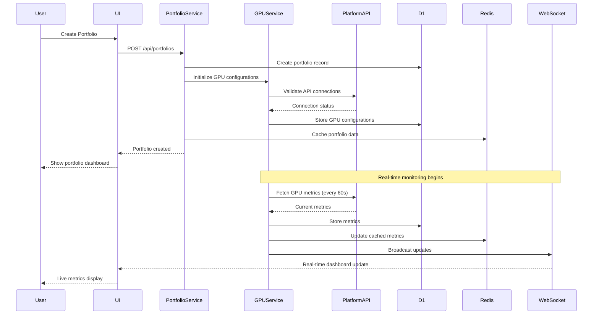

# Feature Specification: Portfolio Management System

## Overview
- Feature ID: FEAT-002
- User Story References: US-004, US-005, US-006, US-007, US-008
- Priority: P1 (Critical)
- Estimated Tokens: 72k

## Visual Design Reference
- Figma Link: N/A (Business planning phase)
- Key Screens: Portfolio Dashboard, Create Portfolio Wizard, GPU Configuration, Portfolio Settings
- Design Tokens: Modern SaaS dashboard patterns with card-based layouts and drag-drop interfaces

## API Specification

### Endpoint: GET /api/portfolios
**Purpose:** List user's portfolios with summary metrics
**Authentication:** JWT token required

**Request:**
```typescript
// Query parameters
interface PortfolioListQuery {
  include?: 'metrics' | 'gpus' | 'all';
  sortBy?: 'name' | 'created' | 'revenue' | 'performance';
  order?: 'asc' | 'desc';
}
```

**Response (200 OK):**
```json
{
  "success": true,
  "data": {
    "portfolios": [
      {
        "id": "portfolio_550e8400-e29b-41d4-a716-446655440000",
        "name": "Gaming Rig Fleet",
        "description": "High-end gaming GPUs for AI training",
        "status": "active",
        "gpuCount": 4,
        "totalPowerConsumption": 1200,
        "estimatedMonthlyRevenue": 2840.50,
        "actualMonthlyRevenue": 2650.25,
        "performanceScore": 94.2,
        "createdAt": "2024-01-15T10:30:00Z",
        "updatedAt": "2024-01-20T15:45:00Z",
        "platformIntegrations": ["runpod", "lambdalabs"],
        "alertsEnabled": true
      }
    ],
    "summary": {
      "totalPortfolios": 1,
      "totalGPUs": 4,
      "totalMonthlyRevenue": 2650.25,
      "averagePerformanceScore": 94.2,
      "tierLimit": 1,
      "canCreateMore": false
    }
  },
  "meta": {
    "timestamp": "2024-01-20T16:00:00Z",
    "version": "1.0.0",
    "requestId": "req_portfolio_list_123"
  }
}
```

**Error Responses:**
- 401: Unauthorized (invalid JWT token)
- 403: Forbidden (unverified email or suspended account)
- 429: Rate limit exceeded (60 requests per minute per user)

### Endpoint: POST /api/portfolios
**Purpose:** Create new portfolio with initial configuration
**Authentication:** JWT token required

**Request:**
```json
{
  "name": "AI Training Farm",
  "description": "Specialized setup for LLM training workloads",
  "timezone": "America/New_York",
  "currency": "USD",
  "platformConfigs": [
    {
      "platform": "runpod",
      "apiKey": "encrypted_api_key_here",
      "region": "us-east-1",
      "enabled": true
    }
  ],
  "initialGPUs": [
    {
      "modelId": "gpu_nvidia_rtx_4090",
      "quantity": 2,
      "customName": "Training Beast 1",
      "overclockSettings": {
        "coreClock": 150,
        "memoryClock": 500,
        "powerLimit": 120,
        "tempLimit": 83
      },
      "pricingConfig": {
        "hourlyRate": 2.50,
        "minimumHours": 1,
        "discountTiers": [
          {"hours": 168, "discount": 0.1},
          {"hours": 720, "discount": 0.15}
        ]
      }
    }
  ],
  "alertPreferences": {
    "utilizationThreshold": 70,
    "temperatureThreshold": 80,
    "revenueDropThreshold": 0.15,
    "notificationChannels": ["email", "discord"]
  }
}
```

**Response (201 Created):**
```json
{
  "success": true,
  "data": {
    "id": "portfolio_abc123-def456-ghi789",
    "name": "AI Training Farm",
    "description": "Specialized setup for LLM training workloads",
    "status": "configuring",
    "gpuCount": 2,
    "estimatedSetupTime": "5-10 minutes",
    "nextSteps": [
      "Verify platform API connections",
      "Test GPU configurations",
      "Activate monitoring",
      "Begin performance tracking"
    ],
    "createdAt": "2024-01-20T16:15:00Z"
  }
}
```

**Error Responses:**
- 400: Invalid input (name too long, invalid GPU model, etc.)
- 402: Payment required (tier limit exceeded, needs upgrade)
- 409: Conflict (portfolio name already exists for user)
- 422: Unprocessable entity (GPU model not available in selected region)

### Endpoint: GET /api/portfolios/{portfolioId}
**Purpose:** Get detailed portfolio information with performance metrics
**Authentication:** JWT token required, portfolio ownership verified

**Response (200 OK):**
```json
{
  "success": true,
  "data": {
    "id": "portfolio_abc123-def456-ghi789",
    "name": "AI Training Farm",
    "description": "Specialized setup for LLM training workloads",
    "status": "active",
    "owner": {
      "id": "user_123",
      "name": "John Doe",
      "tier": "individual"
    },
    "gpus": [
      {
        "id": "gpu_instance_001",
        "modelId": "gpu_nvidia_rtx_4090",
        "customName": "Training Beast 1",
        "status": "online",
        "platform": "runpod",
        "region": "us-east-1",
        "specifications": {
          "memory": "24GB GDDR6X",
          "basePower": 450,
          "cores": 16384,
          "baseClock": 2230,
          "boostClock": 2520
        },
        "currentMetrics": {
          "utilization": 87.3,
          "temperature": 74,
          "powerDraw": 420,
          "memoryUsage": 22.1,
          "uptime": "96.7%",
          "hourlyRevenue": 2.45,
          "lastUpdated": "2024-01-20T16:14:30Z"
        },
        "overclockSettings": {
          "coreClock": 150,
          "memoryClock": 500,
          "powerLimit": 120,
          "tempLimit": 83,
          "applied": true
        },
        "pricingConfig": {
          "hourlyRate": 2.50,
          "currentDemand": "high",
          "competitiveRanking": "top 25%",
          "suggestedRate": 2.65
        }
      }
    ],
    "performanceMetrics": {
      "overall": {
        "score": 94.2,
        "uptime": "96.7%",
        "utilizationAverage": 85.4,
        "revenueEfficiency": 0.92,
        "powerEfficiency": 0.89
      },
      "revenue": {
        "daily": 58.80,
        "weekly": 395.60,
        "monthly": 1682.40,
        "projected": 1750.00,
        "growthRate": 0.045
      },
      "alerts": {
        "active": 0,
        "resolved24h": 2,
        "totalThisWeek": 8
      }
    },
    "platformIntegrations": [
      {
        "platform": "runpod",
        "status": "connected",
        "lastSync": "2024-01-20T16:12:00Z",
        "syncInterval": 60,
        "apiHealth": "healthy"
      }
    ],
    "updatedAt": "2024-01-20T16:14:30Z"
  }
}
```

### Endpoint: PUT /api/portfolios/{portfolioId}
**Purpose:** Update portfolio configuration and settings
**Authentication:** JWT token required, portfolio ownership verified

**Request:**
```json
{
  "name": "Updated AI Training Farm",
  "description": "Enhanced setup with new GPU configurations",
  "alertPreferences": {
    "utilizationThreshold": 75,
    "temperatureThreshold": 78,
    "revenueDropThreshold": 0.12,
    "notificationChannels": ["email", "discord", "webhook"]
  },
  "platformConfigs": [
    {
      "platform": "runpod",
      "apiKey": "updated_encrypted_key",
      "region": "us-east-1",
      "enabled": true,
      "syncInterval": 30
    }
  ]
}
```

**Response (200 OK):**
```json
{
  "success": true,
  "data": {
    "id": "portfolio_abc123-def456-ghi789",
    "name": "Updated AI Training Farm",
    "description": "Enhanced setup with new GPU configurations",
    "updatedAt": "2024-01-20T16:30:00Z",
    "changesApplied": [
      "Alert thresholds updated",
      "Webhook notification channel added",
      "RunPod sync interval changed to 30 seconds"
    ],
    "requiresRestart": false
  }
}
```

### Endpoint: POST /api/portfolios/{portfolioId}/gpus
**Purpose:** Add new GPU to existing portfolio
**Authentication:** JWT token required, portfolio ownership verified

**Request:**
```json
{
  "modelId": "gpu_nvidia_rtx_4080",
  "quantity": 1,
  "customName": "Training Beast 3",
  "platform": "lambdalabs",
  "region": "us-west-2",
  "overclockSettings": {
    "coreClock": 100,
    "memoryClock": 400,
    "powerLimit": 110,
    "tempLimit": 81
  },
  "pricingConfig": {
    "hourlyRate": 2.10,
    "minimumHours": 1,
    "discountTiers": [
      {"hours": 168, "discount": 0.08}
    ]
  }
}
```

**Response (201 Created):**
```json
{
  "success": true,
  "data": {
    "gpu": {
      "id": "gpu_instance_003",
      "modelId": "gpu_nvidia_rtx_4080",
      "customName": "Training Beast 3",
      "status": "provisioning",
      "estimatedSetupTime": "3-5 minutes"
    },
    "portfolio": {
      "id": "portfolio_abc123-def456-ghi789",
      "gpuCount": 3,
      "estimatedMonthlyRevenue": 3200.00,
      "updatedAt": "2024-01-20T16:45:00Z"
    }
  }
}
```

### Endpoint: PUT /api/portfolios/{portfolioId}/gpus/{gpuId}
**Purpose:** Update individual GPU configuration
**Authentication:** JWT token required, portfolio ownership verified

**Request:**
```json
{
  "customName": "Training Beast 1 - Optimized",
  "overclockSettings": {
    "coreClock": 175,
    "memoryClock": 600,
    "powerLimit": 125,
    "tempLimit": 85
  },
  "pricingConfig": {
    "hourlyRate": 2.75,
    "minimumHours": 2,
    "discountTiers": [
      {"hours": 168, "discount": 0.12},
      {"hours": 720, "discount": 0.18}
    ]
  },
  "maintenanceWindow": {
    "enabled": true,
    "timezone": "America/New_York",
    "schedule": "daily",
    "startTime": "03:00",
    "duration": 30
  }
}
```

**Response (200 OK):**
```json
{
  "success": true,
  "data": {
    "id": "gpu_instance_001",
    "customName": "Training Beast 1 - Optimized",
    "status": "updating",
    "changesApplied": [
      "Overclock settings updated",
      "Pricing configuration changed",
      "Maintenance window scheduled"
    ],
    "estimatedApplyTime": "2-3 minutes",
    "updatedAt": "2024-01-20T17:00:00Z"
  }
}
```

### Endpoint: DELETE /api/portfolios/{portfolioId}/gpus/{gpuId}
**Purpose:** Remove GPU from portfolio (soft delete with data retention)
**Authentication:** JWT token required, portfolio ownership verified

**Request:**
```json
{
  "reason": "hardware_upgrade",
  "retainHistoricalData": true,
  "gracefulShutdown": true,
  "notifyClients": true
}
```

**Response (200 OK):**
```json
{
  "success": true,
  "data": {
    "gpu": {
      "id": "gpu_instance_002",
      "status": "decommissioning",
      "estimatedShutdownTime": "5-10 minutes"
    },
    "portfolio": {
      "id": "portfolio_abc123-def456-ghi789",
      "gpuCount": 2,
      "estimatedMonthlyRevenue": 2400.00,
      "updatedAt": "2024-01-20T17:15:00Z"
    },
    "dataRetention": {
      "historicalMetrics": "retained",
      "performanceData": "retained",
      "revenueLogs": "retained",
      "retentionPeriod": "2 years"
    }
  }
}
```

### Endpoint: DELETE /api/portfolios/{portfolioId}
**Purpose:** Delete entire portfolio (soft delete with confirmation)
**Authentication:** JWT token required, portfolio ownership verified

**Request:**
```json
{
  "confirmationText": "DELETE AI Training Farm",
  "reason": "no_longer_needed",
  "retainHistoricalData": true,
  "notifyOnCompletion": true
}
```

**Response (200 OK):**
```json
{
  "success": true,
  "data": {
    "id": "portfolio_abc123-def456-ghi789",
    "name": "AI Training Farm",
    "status": "deleting",
    "estimatedDeletionTime": "10-15 minutes",
    "gpusBeingDecommissioned": 2,
    "dataRetention": {
      "period": "2 years",
      "exportAvailable": true,
      "exportFormats": ["json", "csv", "pdf"]
    },
    "deletedAt": "2024-01-20T17:30:00Z"
  }
}
```

## Component Specification

### Component: PortfolioCard
**Purpose:** Display portfolio summary with key metrics and quick actions
**Props:**
```typescript
interface PortfolioCardProps {
  portfolio: Portfolio;
  onEdit: (portfolioId: string) => void;
  onDelete: (portfolioId: string) => void;
  onViewDetails: (portfolioId: string) => void;
  showMetrics?: boolean;
  compact?: boolean;
}

interface Portfolio {
  id: string;
  name: string;
  description: string;
  status: 'active' | 'inactive' | 'configuring' | 'error';
  gpuCount: number;
  totalPowerConsumption: number;
  estimatedMonthlyRevenue: number;
  actualMonthlyRevenue: number;
  performanceScore: number;
  createdAt: string;
  updatedAt: string;
  platformIntegrations: string[];
  alertsEnabled: boolean;
}
```

**State Management:**
- Local state: hover effects, loading states for actions, expanded metrics view
- Global state: Portfolio data via portfolio context, user subscription tier

**Events:**
- onClick: Navigate to portfolio details page
- onEditClick: Open portfolio editing modal
- onDeleteClick: Show confirmation dialog with data retention options
- onMetricsToggle: Expand/collapse detailed metrics view

### Component: PortfolioWizard
**Purpose:** Multi-step portfolio creation with validation and platform integration
**Props:**
```typescript
interface PortfolioWizardProps {
  onComplete: (portfolio: Portfolio) => void;
  onCancel: () => void;
  userTier: 'free' | 'individual' | 'professional' | 'enterprise';
  existingPortfolioCount: number;
  maxPortfolios: number;
}

interface WizardStep {
  id: number;
  title: string;
  description: string;
  component: React.ComponentType;
  validation: (data: any) => ValidationResult;
  canSkip: boolean;
}
```

**State Management:**
- Local state: current step, form data, validation errors, loading states, platform connection tests
- Global state: Available GPU models, platform configurations, user subscription limits

**Events:**
- onNext: Validate current step and advance
- onPrevious: Navigate to previous step
- onStepClick: Jump to specific step (if validation allows)
- onPlatformTest: Test API connection to hosting platform
- onGPUSelect: Add/remove GPUs from configuration

### Component: GPUConfigurationCard
**Purpose:** Individual GPU setup with overclocking, pricing, and monitoring
**Props:**
```typescript
interface GPUConfigurationCardProps {
  gpu: GPUInstance;
  availableModels: GPUModel[];
  platforms: PlatformConfig[];
  onUpdate: (gpuId: string, config: GPUConfig) => Promise<void>;
  onDelete: (gpuId: string) => Promise<void>;
  readOnly?: boolean;
  showAdvanced?: boolean;
}

interface GPUInstance {
  id: string;
  modelId: string;
  customName: string;
  status: 'online' | 'offline' | 'provisioning' | 'error' | 'maintenance';
  platform: string;
  region: string;
  specifications: GPUSpecs;
  currentMetrics: GPUMetrics;
  overclockSettings: OverclockConfig;
  pricingConfig: PricingConfig;
}
```

**State Management:**
- Local state: editing mode, unsaved changes, validation errors, overclock test results
- Global state: Real-time GPU metrics via WebSocket, market pricing data

**Events:**
- onNameChange: Update custom GPU name with validation
- onOverclockChange: Update overclock settings with safety validation
- onPricingChange: Update pricing with market comparison
- onTestOverclock: Run overclock stability test
- onMaintenanceSchedule: Configure maintenance windows

### Component: PortfolioDashboard
**Purpose:** Comprehensive portfolio overview with real-time metrics and insights
**Props:**
```typescript
interface PortfolioDashboardProps {
  portfolioId: string;
  timeRange: '1h' | '24h' | '7d' | '30d' | '90d';
  onTimeRangeChange: (range: string) => void;
  refreshInterval?: number;
}

interface DashboardWidget {
  id: string;
  title: string;
  type: 'metric' | 'chart' | 'table' | 'alert';
  position: { x: number; y: number; w: number; h: number };
  config: WidgetConfig;
  data: any;
}
```

**State Management:**
- Local state: widget layout, filter selections, chart zoom levels, loading states
- Global state: Real-time portfolio metrics, WebSocket connection status, alert notifications

**Events:**
- onWidgetMove: Drag and drop widget repositioning
- onWidgetResize: Resize widget dimensions
- onFilterChange: Update data filters for charts and tables
- onAlertClick: Navigate to alert details or configuration
- onExport: Export dashboard data to various formats

### Component: PlatformIntegrationPanel
**Purpose:** Manage connections to hosting platforms (RunPod, Lambda Labs, etc.)
**Props:**
```typescript
interface PlatformIntegrationPanelProps {
  portfolioId: string;
  integrations: PlatformIntegration[];
  availablePlatforms: Platform[];
  onAdd: (platform: Platform, config: PlatformConfig) => Promise<void>;
  onUpdate: (integrationId: string, config: PlatformConfig) => Promise<void>;
  onRemove: (integrationId: string) => Promise<void>;
  onTest: (integrationId: string) => Promise<TestResult>;
}

interface PlatformIntegration {
  id: string;
  platform: string;
  status: 'connected' | 'disconnected' | 'error' | 'testing';
  lastSync: string;
  syncInterval: number;
  apiHealth: 'healthy' | 'degraded' | 'error';
  config: PlatformConfig;
  metrics: PlatformMetrics;
}
```

**State Management:**
- Local state: connection testing states, API key visibility, configuration forms
- Global state: Platform availability status, sync schedules, error notifications

**Events:**
- onConnect: Initialize new platform connection with API key validation
- onDisconnect: Safely disconnect platform with data retention options
- onSync: Manually trigger data synchronization
- onConfigChange: Update platform-specific configuration
- onHealthCheck: Test platform API connectivity and performance

## Data Flow



## Library Documentation & Examples

### Required Libraries
```json
{
  "dependencies": {
    "@cloudflare/workers-types": "^4.20240925.0",
    "@cloudflare/d1": "^1.8.0",
    "uuid": "^9.0.1",
    "zod": "^3.22.4",
    "ioredis": "^5.3.2",
    "ws": "^8.16.0",
    "node-cron": "^3.0.3"
  },
  "devDependencies": {
    "wrangler": "^3.78.12",
    "@types/uuid": "^9.0.7",
    "@types/ws": "^8.5.10",
    "@types/node-cron": "^3.0.11"
  }
}
```

### Code Examples (from Cloudflare Docs)

#### Cloudflare Workers D1 Portfolio Management
```typescript
// Source: Cloudflare Docs - D1 with Workers advanced patterns
export default {
  async fetch(request: Request, env: Env): Promise<Response> {
    const url = new URL(request.url);
    
    if (request.method === 'POST' && url.pathname === '/api/portfolios') {
      return handleCreatePortfolio(request, env);
    }
    
    if (request.method === 'GET' && url.pathname.startsWith('/api/portfolios/')) {
      const portfolioId = url.pathname.split('/')[3];
      return handleGetPortfolio(portfolioId, env);
    }
    
    return new Response('Not found', { status: 404 });
  }
};

async function handleCreatePortfolio(request: Request, env: Env): Promise<Response> {
  try {
    const body = await request.json() as CreatePortfolioRequest;
    const userId = await getUserIdFromJWT(request, env);
    
    // Validate user tier limits
    const userTier = await getUserTier(userId, env);
    const portfolioCount = await getPortfolioCount(userId, env);
    
    if (!canCreatePortfolio(userTier, portfolioCount)) {
      return Response.json(
        { success: false, error: 'Portfolio limit exceeded for current tier' },
        { status: 402 }
      );
    }
    
    // Validate input using Zod
    const validatedData = portfolioSchema.parse(body);
    
    // Create portfolio with transaction
    const portfolioId = crypto.randomUUID();
    
    await env.DB.batch([
      env.DB.prepare(`
        INSERT INTO portfolios (id, user_id, name, description, timezone, 
                               currency, status, created_at)
        VALUES (?, ?, ?, ?, ?, ?, ?, ?)
      `).bind(
        portfolioId,
        userId,
        validatedData.name,
        validatedData.description,
        validatedData.timezone,
        validatedData.currency,
        'configuring',
        new Date().toISOString()
      ),
      
      // Create alert preferences
      env.DB.prepare(`
        INSERT INTO portfolio_alert_preferences (portfolio_id, utilization_threshold,
                                                temperature_threshold, revenue_drop_threshold,
                                                notification_channels, created_at)
        VALUES (?, ?, ?, ?, ?, ?)
      `).bind(
        portfolioId,
        validatedData.alertPreferences.utilizationThreshold,
        validatedData.alertPreferences.temperatureThreshold,
        validatedData.alertPreferences.revenueDropThreshold,
        JSON.stringify(validatedData.alertPreferences.notificationChannels),
        new Date().toISOString()
      )
    ]);
    
    // Create initial GPUs if provided
    if (validatedData.initialGPUs && validatedData.initialGPUs.length > 0) {
      await createInitialGPUs(portfolioId, validatedData.initialGPUs, env);
    }
    
    // Set up platform integrations
    if (validatedData.platformConfigs) {
      await createPlatformIntegrations(portfolioId, validatedData.platformConfigs, env);
    }
    
    // Cache portfolio data in Redis
    await cachePortfolioData(portfolioId, env);
    
    // Schedule monitoring setup
    await schedulePortfolioMonitoring(portfolioId, env);
    
    return Response.json({
      success: true,
      data: {
        id: portfolioId,
        name: validatedData.name,
        description: validatedData.description,
        status: 'configuring',
        gpuCount: validatedData.initialGPUs?.length || 0,
        estimatedSetupTime: '5-10 minutes',
        nextSteps: [
          'Verify platform API connections',
          'Test GPU configurations',
          'Activate monitoring',
          'Begin performance tracking'
        ],
        createdAt: new Date().toISOString()
      }
    }, { status: 201 });
    
  } catch (error) {
    console.error('Portfolio creation error:', error);
    
    if (error instanceof z.ZodError) {
      return Response.json(
        { 
          success: false, 
          error: 'Validation failed',
          fieldErrors: error.errors.map(e => ({
            field: e.path.join('.'),
            message: e.message
          }))
        },
        { status: 400 }
      );
    }
    
    return Response.json(
      { success: false, error: 'Portfolio creation failed' },
      { status: 500 }
    );
  }
}

async function createInitialGPUs(portfolioId: string, gpus: InitialGPU[], env: Env) {
  const gpuInserts = gpus.map(gpu => {
    const gpuId = crypto.randomUUID();
    return env.DB.prepare(`
      INSERT INTO gpu_instances (id, portfolio_id, model_id, custom_name, quantity,
                                platform, region, status, overclock_settings,
                                pricing_config, created_at)
      VALUES (?, ?, ?, ?, ?, ?, ?, ?, ?, ?, ?)
    `).bind(
      gpuId,
      portfolioId,
      gpu.modelId,
      gpu.customName,
      gpu.quantity,
      'manual', // Will be updated when platform is connected
      'global',
      'provisioning',
      JSON.stringify(gpu.overclockSettings),
      JSON.stringify(gpu.pricingConfig),
      new Date().toISOString()
    );
  });
  
  await env.DB.batch(gpuInserts);
}
```

#### GPU Performance Monitoring with Durable Objects
```typescript
// Source: Cloudflare Docs - Durable Objects for real-time monitoring
export class PerformanceMonitor {
  private state: DurableObjectState;
  private env: Env;
  private sessions: Map<string, WebSocket> = new Map();
  
  constructor(state: DurableObjectState, env: Env) {
    this.state = state;
    this.env = env;
    
    // Set up monitoring interval
    this.startMonitoring();
  }
  
  async fetch(request: Request): Promise<Response> {
    const url = new URL(request.url);
    
    if (url.pathname === '/websocket') {
      const [client, server] = Object.values(new WebSocketPair());
      
      server.accept();
      server.addEventListener('message', (event) => {
        const data = JSON.parse(event.data as string);
        if (data.type === 'subscribe' && data.portfolioId) {
          this.sessions.set(data.portfolioId, server);
        }
      });
      
      server.addEventListener('close', () => {
        // Clean up session
        for (const [portfolioId, socket] of this.sessions.entries()) {
          if (socket === server) {
            this.sessions.delete(portfolioId);
            break;
          }
        }
      });
      
      return new Response(null, { status: 101, webSocket: client });
    }
    
    return new Response('Not found', { status: 404 });
  }
  
  private async startMonitoring() {
    // Monitor every 60 seconds
    setInterval(async () => {
      await this.collectAndBroadcastMetrics();
    }, 60000);
  }
  
  private async collectAndBroadcastMetrics() {
    try {
      // Get all active portfolios being monitored
      const activePortfolios = Array.from(this.sessions.keys());
      
      for (const portfolioId of activePortfolios) {
        const metrics = await this.collectPortfolioMetrics(portfolioId);
        const socket = this.sessions.get(portfolioId);
        
        if (socket && socket.readyState === WebSocket.OPEN) {
          socket.send(JSON.stringify({
            type: 'metrics_update',
            portfolioId,
            timestamp: Date.now(),
            data: metrics
          }));
        }
      }
    } catch (error) {
      console.error('Monitoring error:', error);
    }
  }
  
  private async collectPortfolioMetrics(portfolioId: string) {
    // Get GPU instances for portfolio
    const gpus = await this.env.DB.prepare(`
      SELECT g.*, pi.api_config, pi.status as platform_status
      FROM gpu_instances g
      JOIN platform_integrations pi ON g.platform = pi.platform
      WHERE g.portfolio_id = ? AND g.status = 'active'
    `).bind(portfolioId).all();
    
    const metricsPromises = gpus.results.map(async (gpu: any) => {
      try {
        // Fetch real-time metrics from platform API
        const platformMetrics = await this.fetchPlatformMetrics(gpu);
        
        // Calculate derived metrics
        const derivedMetrics = this.calculateDerivedMetrics(gpu, platformMetrics);
        
        // Store in database for historical tracking
        await this.storeMetrics(gpu.id, platformMetrics, derivedMetrics);
        
        return {
          gpuId: gpu.id,
          customName: gpu.custom_name,
          ...platformMetrics,
          ...derivedMetrics
        };
      } catch (error) {
        console.error(`Error collecting metrics for GPU ${gpu.id}:`, error);
        return null;
      }
    });
    
    const gpuMetrics = (await Promise.all(metricsPromises)).filter(Boolean);
    
    // Calculate portfolio-level aggregations
    const portfolioMetrics = this.calculatePortfolioMetrics(gpuMetrics);
    
    return {
      portfolio: portfolioMetrics,
      gpus: gpuMetrics
    };
  }
  
  private async fetchPlatformMetrics(gpu: any) {
    // This would integrate with actual platform APIs
    // Placeholder for RunPod, Lambda Labs, etc.
    return {
      utilization: Math.random() * 100,
      temperature: 65 + Math.random() * 20,
      powerDraw: gpu.base_power * (0.8 + Math.random() * 0.4),
      memoryUsage: Math.random() * 100,
      uptime: 0.95 + Math.random() * 0.05
    };
  }
  
  private calculateDerivedMetrics(gpu: any, platformMetrics: any) {
    const overclockSettings = JSON.parse(gpu.overclock_settings || '{}');
    const pricingConfig = JSON.parse(gpu.pricing_config || '{}');
    
    return {
      efficiency: platformMetrics.utilization / (platformMetrics.powerDraw / gpu.base_power),
      hourlyRevenue: pricingConfig.hourlyRate * (platformMetrics.utilization / 100),
      overclockStability: this.calculateOverclockStability(overclockSettings, platformMetrics),
      performanceScore: this.calculatePerformanceScore(platformMetrics)
    };
  }
  
  private calculateOverclockStability(settings: any, metrics: any): number {
    // Simplified stability calculation
    const tempFactor = 1 - Math.max(0, (metrics.temperature - 80) / 20);
    const powerFactor = 1 - Math.max(0, (metrics.powerDraw - settings.powerLimit) / settings.powerLimit);
    return Math.min(tempFactor * powerFactor, 1) * 100;
  }
  
  private calculatePerformanceScore(metrics: any): number {
    // Weighted performance score
    const utilizationWeight = 0.4;
    const temperatureWeight = 0.2; // Lower is better
    const uptimeWeight = 0.3;
    const powerEfficiencyWeight = 0.1;
    
    const tempScore = Math.max(0, (85 - metrics.temperature) / 85) * 100;
    const powerEfficiency = metrics.utilization / (metrics.powerDraw / 450); // Normalized to RTX 4090
    
    return (
      metrics.utilization * utilizationWeight +
      tempScore * temperatureWeight +
      metrics.uptime * 100 * uptimeWeight +
      Math.min(powerEfficiency * 100, 100) * powerEfficiencyWeight
    );
  }
  
  private calculatePortfolioMetrics(gpuMetrics: any[]) {
    if (gpuMetrics.length === 0) return {};
    
    const totalGPUs = gpuMetrics.length;
    const avgUtilization = gpuMetrics.reduce((sum, gpu) => sum + gpu.utilization, 0) / totalGPUs;
    const avgTemperature = gpuMetrics.reduce((sum, gpu) => sum + gpu.temperature, 0) / totalGPUs;
    const totalPowerDraw = gpuMetrics.reduce((sum, gpu) => sum + gpu.powerDraw, 0);
    const totalHourlyRevenue = gpuMetrics.reduce((sum, gpu) => sum + gpu.hourlyRevenue, 0);
    const avgPerformanceScore = gpuMetrics.reduce((sum, gpu) => sum + gpu.performanceScore, 0) / totalGPUs;
    const avgUptime = gpuMetrics.reduce((sum, gpu) => sum + gpu.uptime, 0) / totalGPUs;
    
    return {
      totalGPUs,
      avgUtilization: Math.round(avgUtilization * 100) / 100,
      avgTemperature: Math.round(avgTemperature * 100) / 100,
      totalPowerDraw: Math.round(totalPowerDraw),
      dailyRevenue: Math.round(totalHourlyRevenue * 24 * 100) / 100,
      monthlyRevenue: Math.round(totalHourlyRevenue * 24 * 30 * 100) / 100,
      performanceScore: Math.round(avgPerformanceScore * 100) / 100,
      uptime: Math.round(avgUptime * 10000) / 100 // Percentage with 2 decimals
    };
  }
}
```

#### React Dashboard with Real-Time Updates
```typescript
// Source: React 18 + TypeScript + WebSocket current patterns
'use client';

import { useState, useEffect, useCallback } from 'react';
import { usePortfolio } from '@/hooks/usePortfolio';
import { useWebSocket } from '@/hooks/useWebSocket';
import { PortfolioMetrics, GPUMetrics } from '@/types/portfolio';

interface PortfolioDashboardProps {
  portfolioId: string;
  timeRange: '1h' | '24h' | '7d' | '30d' | '90d';
  onTimeRangeChange: (range: string) => void;
}

export function PortfolioDashboard({ 
  portfolioId, 
  timeRange, 
  onTimeRangeChange 
}: PortfolioDashboardProps) {
  const [metrics, setMetrics] = useState<PortfolioMetrics | null>(null);
  const [gpuMetrics, setGpuMetrics] = useState<GPUMetrics[]>([]);
  const [isLoading, setIsLoading] = useState(true);
  const [lastUpdated, setLastUpdated] = useState<Date | null>(null);
  
  const { portfolio, loading: portfolioLoading, error } = usePortfolio(portfolioId);
  
  // WebSocket connection for real-time updates
  const { isConnected, sendMessage } = useWebSocket(`/api/portfolios/${portfolioId}/websocket`, {
    onMessage: useCallback((data: any) => {
      if (data.type === 'metrics_update') {
        setMetrics(data.data.portfolio);
        setGpuMetrics(data.data.gpus);
        setLastUpdated(new Date());
      }
    }, []),
    onConnect: useCallback(() => {
      // Subscribe to portfolio metrics
      sendMessage({
        type: 'subscribe',
        portfolioId
      });
    }, [portfolioId, sendMessage])
  });
  
  // Initial data load
  useEffect(() => {
    async function loadInitialData() {
      if (!portfolio) return;
      
      try {
        setIsLoading(true);
        
        const response = await fetch(`/api/portfolios/${portfolioId}/metrics?timeRange=${timeRange}`);
        const data = await response.json();
        
        if (data.success) {
          setMetrics(data.data.portfolio);
          setGpuMetrics(data.data.gpus);
          setLastUpdated(new Date());
        }
      } catch (error) {
        console.error('Failed to load portfolio metrics:', error);
      } finally {
        setIsLoading(false);
      }
    }
    
    loadInitialData();
  }, [portfolioId, timeRange, portfolio]);
  
  const handleRefresh = useCallback(async () => {
    setIsLoading(true);
    
    try {
      const response = await fetch(`/api/portfolios/${portfolioId}/metrics?timeRange=${timeRange}&force=true`);
      const data = await response.json();
      
      if (data.success) {
        setMetrics(data.data.portfolio);
        setGpuMetrics(data.data.gpus);
        setLastUpdated(new Date());
      }
    } catch (error) {
      console.error('Failed to refresh metrics:', error);
    } finally {
      setIsLoading(false);
    }
  }, [portfolioId, timeRange]);
  
  if (portfolioLoading || isLoading) {
    return <DashboardSkeleton />;
  }
  
  if (error) {
    return <ErrorState error={error} onRetry={handleRefresh} />;
  }
  
  if (!portfolio || !metrics) {
    return <EmptyState portfolioId={portfolioId} />;
  }
  
  return (
    <div className="portfolio-dashboard">
      <DashboardHeader 
        portfolio={portfolio}
        metrics={metrics}
        isConnected={isConnected}
        lastUpdated={lastUpdated}
        onRefresh={handleRefresh}
      />
      
      <div className="dashboard-controls">
        <TimeRangeSelector 
          value={timeRange}
          onChange={onTimeRangeChange}
        />
        
        <ViewModeToggle />
        
        <ExportButton 
          portfolioId={portfolioId}
          timeRange={timeRange}
        />
      </div>
      
      <div className="dashboard-grid">
        <MetricsOverview 
          metrics={metrics}
          timeRange={timeRange}
        />
        
        <RevenueChart 
          portfolioId={portfolioId}
          timeRange={timeRange}
          data={metrics.revenue}
        />
        
        <PerformanceChart 
          portfolioId={portfolioId}
          timeRange={timeRange}
          data={metrics.performance}
        />
        
        <GPUGrid 
          gpus={gpuMetrics}
          onGPUClick={handleGPUDetails}
          onGPUEdit={handleGPUEdit}
        />
        
        <AlertsSummary 
          portfolioId={portfolioId}
          alerts={metrics.alerts}
        />
        
        <ActivityFeed 
          portfolioId={portfolioId}
          timeRange={timeRange}
        />
      </div>
    </div>
  );
}

function DashboardHeader({ 
  portfolio, 
  metrics, 
  isConnected, 
  lastUpdated, 
  onRefresh 
}: {
  portfolio: any;
  metrics: PortfolioMetrics;
  isConnected: boolean;
  lastUpdated: Date | null;
  onRefresh: () => void;
}) {
  return (
    <div className="dashboard-header">
      <div className="portfolio-info">
        <h1>{portfolio.name}</h1>
        <p className="description">{portfolio.description}</p>
        
        <div className="status-indicators">
          <StatusIndicator 
            label="Connection"
            status={isConnected ? 'connected' : 'disconnected'}
            icon={isConnected ? 'wifi' : 'wifi-off'}
          />
          
          <StatusIndicator 
            label="Portfolio"
            status={portfolio.status}
            icon={getStatusIcon(portfolio.status)}
          />
          
          {lastUpdated && (
            <span className="last-updated">
              Last updated: {formatRelativeTime(lastUpdated)}
            </span>
          )}
        </div>
      </div>
      
      <div className="key-metrics">
        <MetricCard 
          label="Monthly Revenue"
          value={formatCurrency(metrics.monthlyRevenue)}
          change={metrics.revenueGrowth}
          trend="up"
        />
        
        <MetricCard 
          label="Performance Score"
          value={`${metrics.performanceScore}%`}
          change={metrics.performanceChange}
          trend={metrics.performanceChange > 0 ? 'up' : 'down'}
        />
        
        <MetricCard 
          label="Average Utilization"
          value={`${metrics.avgUtilization}%`}
          change={metrics.utilizationChange}
          trend={metrics.utilizationChange > 0 ? 'up' : 'down'}
        />
        
        <MetricCard 
          label="Active GPUs"
          value={metrics.totalGPUs}
          subtitle={`${metrics.onlineGPUs} online`}
        />
      </div>
      
      <div className="header-actions">
        <button 
          onClick={onRefresh}
          className="btn-secondary"
          disabled={!isConnected}
        >
          Refresh
        </button>
        
        <button className="btn-primary">
          Add GPU
        </button>
        
        <MoreActionsMenu portfolioId={portfolio.id} />
      </div>
    </div>
  );
}
```

### Important Implementation Notes

#### Tier-Based Portfolio Limits
```typescript
// Portfolio creation limits by subscription tier
const PORTFOLIO_LIMITS = {
  free: 1,
  individual: 3,
  professional: 10,
  enterprise: -1 // Unlimited
} as const;

async function canCreatePortfolio(userTier: string, currentCount: number): Promise<boolean> {
  const limit = PORTFOLIO_LIMITS[userTier as keyof typeof PORTFOLIO_LIMITS];
  return limit === -1 || currentCount < limit;
}
```

#### GPU Model Validation
```typescript
// Validate GPU models against specifications database
const gpuModelSchema = z.object({
  modelId: z.string().regex(/^gpu_[a-z0-9_]+$/, 'Invalid GPU model ID format'),
  quantity: z.number().min(1).max(100),
  customName: z.string().min(1).max(100),
  overclockSettings: z.object({
    coreClock: z.number().min(-500).max(500),
    memoryClock: z.number().min(-1000).max(1000),
    powerLimit: z.number().min(50).max(150),
    tempLimit: z.number().min(60).max(95)
  }),
  pricingConfig: z.object({
    hourlyRate: z.number().min(0.01).max(100),
    minimumHours: z.number().min(1).max(168),
    discountTiers: z.array(z.object({
      hours: z.number().min(1),
      discount: z.number().min(0).max(0.5)
    })).optional()
  })
});
```

#### Real-Time WebSocket Integration
```typescript
// WebSocket message types for portfolio updates
interface WebSocketMessage {
  type: 'subscribe' | 'unsubscribe' | 'metrics_update' | 'alert' | 'status_change';
  portfolioId?: string;
  timestamp: number;
  data?: any;
}

// Performance monitoring with circuit breaker pattern
class PerformanceCollector {
  private circuitBreaker = new CircuitBreaker({
    failureThreshold: 5,
    resetTimeout: 30000
  });
  
  async collectMetrics(portfolioId: string): Promise<PortfolioMetrics> {
    return this.circuitBreaker.call(async () => {
      // Collect metrics with timeout
      const metrics = await Promise.race([
        this.doCollectMetrics(portfolioId),
        new Promise((_, reject) => 
          setTimeout(() => reject(new Error('Timeout')), 10000)
        )
      ]);
      
      return metrics;
    });
  }
}
```

## Validation Rules
- **Portfolio Name**: Required, 1-100 characters, unique per user
- **Description**: Optional, max 500 characters
- **GPU Model ID**: Must exist in specifications database
- **Quantity**: 1-100 GPUs per configuration
- **Custom Name**: 1-100 characters, unique within portfolio
- **Overclock Settings**: Within safe hardware limits for each GPU model
- **Hourly Rate**: $0.01-$100.00, competitive analysis warnings above market rate
- **Platform Integration**: Valid API keys, successful connection test required

## Error Handling
- **Network Errors**: Retry with exponential backoff (3 attempts)
- **Validation Errors**: Inline field messages with specific guidance
- **Platform API Errors**: Graceful degradation to cached data
- **WebSocket Disconnects**: Automatic reconnection with fallback to polling
- **GPU Provisioning Failures**: Clear error messages with retry options

## Registry Updates Required
- **endpoints.json**: Add portfolio CRUD endpoints, GPU management endpoints, metrics endpoints
- **components.json**: Register PortfolioCard, PortfolioWizard, GPUConfigurationCard, PortfolioDashboard
- **schemas.json**: Add Portfolio, GPUInstance, PortfolioMetrics, PlatformIntegration data models

## Performance Requirements
- **Portfolio Creation**: Complete within 10 seconds including platform validation
- **Dashboard Load**: Display within 2 seconds with skeleton loading
- **Real-Time Updates**: WebSocket metrics delivery within 5 seconds of collection
- **GPU Configuration**: Apply changes within 30 seconds
- **Bulk Operations**: Handle up to 50 GPUs per portfolio efficiently

## Security Considerations
- **Platform API Keys**: Encrypt using AES-256 before database storage
- **Portfolio Ownership**: Verify JWT user ID matches portfolio owner
- **Rate Limiting**: 60 requests per minute per user for portfolio operations
- **Input Validation**: Sanitize all user inputs, especially custom names and descriptions
- **Audit Logging**: Log all portfolio configuration changes for compliance
- **Data Isolation**: Ensure users can only access their own portfolios and metrics