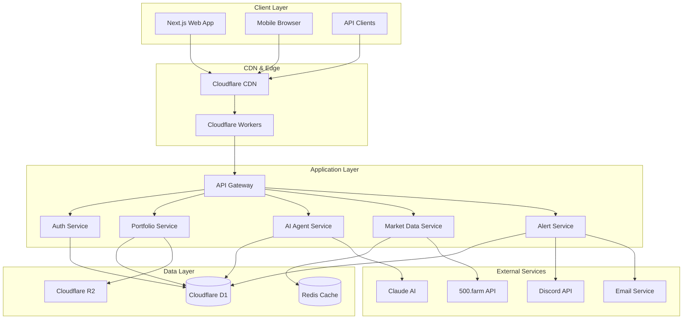
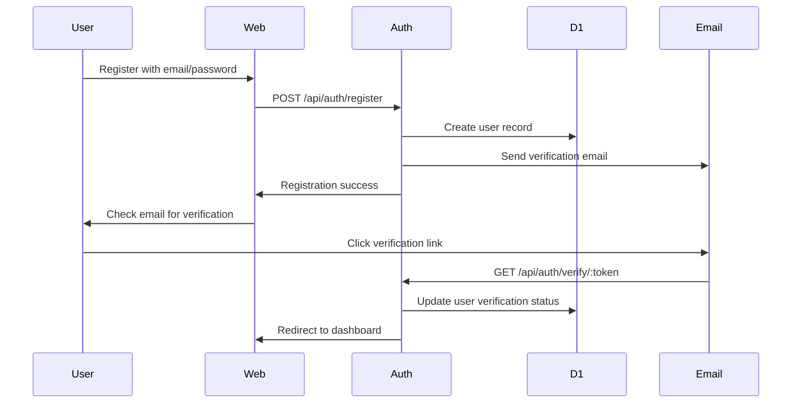
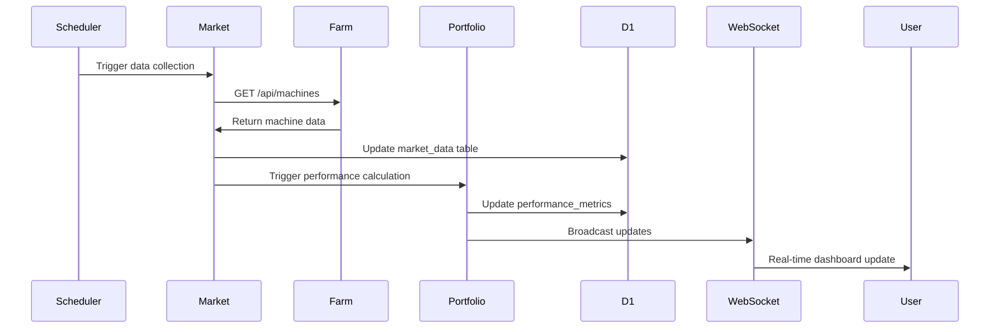

# Specification: GPUScout Platform

## Requirements Document

### Executive Summary

GPUScout is an AI-powered analytics platform designed to transform GPU hosting from manual guesswork into data-driven profit maximization. Built by operators managing 50+ enterprise GPUs for the GPU hosting community of 20,000+ individual hosts and small farms globally.

The platform provides real-time portfolio analytics, AI-powered optimization recommendations, competitive intelligence, and proactive alerting through a modern web interface and conversational AI agent. With a freemium SaaS model starting at $19/month, GPUScout targets 5-10% revenue increases for users while democratizing enterprise-level market intelligence.

Core differentiators include authentic operator credibility, community-first approach with substantial free tier, superior UX focused on revenue optimization rather than technical complexity, and AI-first architecture leveraging Claude + Gemini for personalized insights.

### User Stories (EARS Format)

#### Epic: User Management & Authentication
- WHEN user visits registration page THE system SHALL display email/password form with timezone selection
- WHEN user submits valid registration data THE system SHALL create account and send verification email within 5 minutes
- WHERE user email is not verified THE system SHALL restrict access to verification-only pages
- IF email already exists THEN THE system SHALL display "Email already registered" error
- WHILE user session is active THE system SHALL refresh JWT tokens before expiry
- THE system SHALL encrypt all passwords using bcrypt with 12 salt rounds

#### Epic: Portfolio Management
- WHEN authenticated user creates portfolio THE system SHALL guide through GPU selection wizard
- WHERE user has free tier THE system SHALL limit to 1 portfolio maximum
- IF GPU model is not in database THEN THE system SHALL allow custom model entry with manual specifications
- WHILE portfolio is active THE system SHALL collect performance metrics every 60 seconds
- THE system SHALL calculate estimated monthly revenue using AI algorithms and market data

#### Epic: AI-Powered Analytics
- WHEN user asks question THE AI agent SHALL respond within 5 seconds using conversational context
- WHERE user has conversation history THE system SHALL maintain context across sessions
- IF user exceeds quota THEN THE system SHALL display upgrade prompt with clear benefits
- WHILE generating recommendations THE system SHALL use real-time market data and portfolio specifics
- THE system SHALL personalize AI responses based on user's technical proficiency and hardware setup

#### Epic: Market Intelligence
- WHEN market data is updated THE system SHALL refresh pricing comparisons within 15 minutes
- WHERE user's pricing differs significantly from market THE system SHALL generate optimization alert
- IF 500.farm API is unavailable THEN THE system SHALL display cached data with staleness indicator
- WHILE analyzing trends THE system SHALL consider seasonal factors and historical patterns
- THE system SHALL provide competitive positioning relative to similar hardware configurations

#### Epic: Real-Time Dashboard
- WHEN user accesses dashboard THE system SHALL load portfolio data within 2 seconds
- WHERE GPU utilization drops below threshold THE system SHALL trigger immediate alert
- IF real-time data is stale THE system SHALL display last-updated timestamp and refresh option
- WHILE dashboard is open THE system SHALL update metrics via WebSocket every 60 seconds
- THE system SHALL display mobile-responsive interface across all device types

#### Epic: Alerts & Notifications
- WHEN alert conditions are met THE system SHALL deliver notifications within 10 minutes
- WHERE user configures multiple channels THE system SHALL send to email, Discord, and webhooks simultaneously
- IF notification delivery fails THE system SHALL retry with exponential backoff up to 3 attempts
- WHILE alert is active THE system SHALL suppress duplicate notifications for 4 hours
- THE system SHALL provide clear actionable guidance in all alert messages

### Functional Requirements

#### Authentication & User Management
- **FR001**: Secure user registration with email verification and GDPR compliance
- **FR002**: JWT-based authentication with refresh tokens and session management
- **FR003**: Multi-factor authentication using TOTP (Google Authenticator, Authy)
- **FR004**: Password reset via secure email tokens with 24-hour expiration
- **FR005**: User profile management with timezone, language, and preference settings

#### Portfolio & GPU Configuration
- **FR006**: Portfolio creation wizard with GPU model selection and validation
- **FR007**: Individual GPU configuration with custom naming and overclocking settings
- **FR008**: Platform mapping to RunPod, Lambda Labs, and custom hosting services
- **FR009**: Power consumption calculation and cost analysis
- **FR010**: Portfolio performance tracking with historical data retention

#### AI-Powered Features
- **FR011**: Conversational AI agent with Claude integration and context memory
- **FR012**: Personalized optimization recommendations based on portfolio analysis
- **FR013**: AI-powered pricing strategy advisor with revenue impact estimation
- **FR014**: Proactive market opportunity identification and alerting
- **FR015**: Usage quota management and tier-based feature access

#### Market Intelligence
- **FR016**: Real-time pricing data integration from 500.farm API
- **FR017**: Competitive analysis dashboard with market positioning
- **FR018**: Historical trend analysis with seasonal factor consideration
- **FR019**: Demand forecasting using machine learning models
- **FR020**: Price arbitrage opportunity detection and notification

#### Dashboard & Analytics
- **FR021**: Real-time portfolio dashboard with WebSocket updates
- **FR022**: Performance metrics visualization with customizable time ranges
- **FR023**: Revenue tracking and trend analysis with export capabilities
- **FR024**: GPU-specific monitoring (temperature, power, uptime)
- **FR025**: Mobile-responsive interface with offline capability

#### Alerts & Notifications
- **FR026**: Configurable alert system with multiple trigger conditions
- **FR027**: Multi-channel notification delivery (email, Discord, webhook)
- **FR028**: Alert suppression and rate limiting to prevent spam
- **FR029**: Delivery confirmation and retry logic with exponential backoff
- **FR030**: Alert effectiveness tracking and user feedback collection

### Non-Functional Requirements

#### Performance
- WHEN user accesses dashboard THE system SHALL load within 2 seconds on standard broadband
- WHERE API requests exceed 500ms response time THE system SHALL log performance warnings
- WHILE handling 100 concurrent users THE system SHALL maintain sub-200ms API response times
- THE system SHALL support horizontal scaling to 1000+ concurrent users with auto-scaling

#### Security
- THE system SHALL encrypt all data in transit using TLS 1.3
- WHERE sensitive data is stored THE system SHALL use AES-256 encryption at rest
- WHEN suspicious activity is detected THE system SHALL trigger security alerts
- THE system SHALL validate all inputs against SQL injection and XSS attacks

#### Reliability
- THE system SHALL maintain 99.5% uptime with maximum 3.6 hours downtime per month
- WHERE system failures occur THE system SHALL recover within 15 minutes
- WHEN database queries fail THE system SHALL retry with circuit breaker patterns
- THE system SHALL backup all user data daily with 30-day retention

#### Accessibility
- THE system SHALL meet WCAG 2.1 AA compliance standards
- WHERE users navigate with keyboard THE system SHALL provide clear focus indicators
- WHEN screen readers are used THE system SHALL provide proper ARIA labels
- THE system SHALL support browser zoom up to 200% without functionality loss

## Design Document

### System Architecture

### Data Flow Diagrams

#### User Authentication Flow

#### Portfolio Performance Update Flow

### Component Architecture

#### Frontend Components (Next.js 14 + TypeScript)
- **DashboardLayout**: Main app shell with navigation and user context
- **PortfolioOverview**: Portfolio summary cards with real-time metrics
- **GPUConfigCard**: Individual GPU configuration display and editing
- **AIChat**: Conversational interface with message history
- **MarketIntelligence**: Pricing comparison and trend visualization
- **AlertCenter**: Alert configuration and delivery status
- **UserSettings**: Profile management and subscription controls

#### Backend Services (Cloudflare Workers + D1)
- **AuthService**: JWT token management, user CRUD, session handling
- **PortfolioService**: GPU configuration management, performance tracking
- **AIService**: Claude integration, conversation memory, personalization
- **MarketService**: 500.farm integration, pricing analysis, trend detection
- **AlertService**: Notification delivery, condition evaluation, rate limiting
- **WebSocketService**: Real-time updates, connection management

## Task List

### Phase 1: Foundation (MVP - Months 1-3)

#### Authentication & Core Infrastructure
- [ ] **TASK-001**: Set up Cloudflare Workers + D1 project structure [Link: #project-setup]
- [ ] **TASK-002**: Implement user registration with email verification [Link: #auth-requirements]
- [ ] **TASK-003**: Create JWT authentication system with refresh tokens [Link: #auth-system]
- [ ] **TASK-004**: Set up database schema with migration system [Link: #data-model]

#### Portfolio Management
- [ ] **TASK-005**: Build portfolio creation wizard with GPU selection [Link: #portfolio-creation]
- [ ] **TASK-006**: Implement GPU configuration management [Link: #gpu-config]
- [ ] **TASK-007**: Create performance metrics collection system [Link: #performance-tracking]
- [ ] **TASK-008**: Build real-time dashboard with WebSocket updates [Link: #dashboard]

#### Basic AI Integration
- [ ] **TASK-009**: Integrate Claude AI for basic Q&A functionality [Link: #ai-integration]
- [ ] **TASK-010**: Implement conversation memory and context management [Link: #ai-memory]
- [ ] **TASK-011**: Create usage quota system for free/paid tiers [Link: #quota-system]

#### Market Data Integration
- [ ] **TASK-012**: Integrate 500.farm API for market data collection [Link: #market-integration]
- [ ] **TASK-013**: Build pricing comparison and market positioning [Link: #pricing-intelligence]
- [ ] **TASK-014**: Implement basic alert system for utilization drops [Link: #basic-alerts]

### Phase 2: Enhanced Features (Months 4-6)

#### Advanced AI Features
- [ ] **TASK-015**: Develop personalized AI agent with user profiling [Link: #personalized-ai]
- [ ] **TASK-016**: Implement portfolio optimization recommendations [Link: #optimization-engine]
- [ ] **TASK-017**: Create AI-powered pricing strategy advisor [Link: #pricing-advisor]

#### Advanced Analytics
- [ ] **TASK-018**: Build competitive analysis dashboard [Link: #competitive-analysis]
- [ ] **TASK-019**: Implement demand forecasting models [Link: #demand-forecasting]
- [ ] **TASK-020**: Create ROI calculator and investment advisor [Link: #roi-calculator]

#### Enhanced Alerts & Notifications
- [ ] **TASK-021**: Develop proactive market opportunity detection [Link: #opportunity-alerts]
- [ ] **TASK-022**: Implement multi-channel notification system [Link: #notification-system]
- [ ] **TASK-023**: Create alert effectiveness tracking and optimization [Link: #alert-optimization]

#### Subscription & Billing
- [ ] **TASK-024**: Integrate Stripe for subscription management [Link: #billing-system]
- [ ] **TASK-025**: Implement tier-based feature access control [Link: #feature-access]
- [ ] **TASK-026**: Create subscription upgrade/downgrade flows [Link: #subscription-management]

### Phase 3: Scale and Enterprise (Months 7-12)

#### Multi-Platform Support
- [ ] **TASK-027**: Integrate RunPod API for direct data access [Link: #runpod-integration]
- [ ] **TASK-028**: Integrate Lambda Labs API for platform diversity [Link: #lambda-integration]
- [ ] **TASK-029**: Build unified multi-platform dashboard [Link: #multi-platform-dashboard]

#### API & Integrations
- [ ] **TASK-030**: Develop comprehensive REST API [Link: #rest-api]
- [ ] **TASK-031**: Create webhook system for real-time events [Link: #webhook-system]
- [ ] **TASK-032**: Build API documentation and developer portal [Link: #api-docs]

#### Enterprise Features
- [ ] **TASK-033**: Implement white-label branding system [Link: #white-label]
- [ ] **TASK-034**: Create multi-tenant user management [Link: #multi-tenant]
- [ ] **TASK-035**: Build enterprise reporting and analytics [Link: #enterprise-analytics]

## Test Strategy

### Testing Framework
- **Unit Tests**: Jest with 90%+ coverage requirement
- **Integration Tests**: Supertest for API endpoints
- **E2E Tests**: Playwright for complete user journeys
- **Performance Tests**: Artillery for load testing
- **Security Tests**: OWASP ZAP for vulnerability scanning

### MCP Tool Integration
- **Playwright MCP**: Automated browser testing and visual regression
- **Grafana MCP**: Performance monitoring during tests
- **DataDog MCP**: APM tracing for debugging test failures
- **Sentry MCP**: Error tracking and test failure analysis

### Test Coverage Requirements
- Unit test coverage: 90% minimum for all business logic
- Integration tests for all API endpoints
- E2E tests for critical user paths (registration, portfolio creation, AI chat)
- Performance benchmarks for dashboard load times (<2s) and API responses (<500ms)

## Accessibility Requirements

### WCAG 2.1 AA Compliance
- WHEN users navigate with keyboard THE system SHALL provide visible focus indicators
- WHERE images are used THE system SHALL provide descriptive alt text
- IF color is used to convey information THEN THE system SHALL provide alternative indicators
- WHILE forms are being completed THE system SHALL provide clear error messages and labels
- THE system SHALL maintain 4.5:1 color contrast ratio for normal text

### Screen Reader Support
- THE system SHALL use semantic HTML elements for proper content structure
- WHERE dynamic content updates THE system SHALL announce changes to screen readers
- WHEN forms have errors THE system SHALL associate error messages with form fields
- THE system SHALL provide skip links for keyboard navigation efficiency

### Mobile Accessibility
- THE system SHALL support browser zoom up to 200% without horizontal scrolling
- WHERE touch targets are used THE system SHALL maintain minimum 44px click area
- WHEN orientation changes THE system SHALL maintain full functionality
- THE system SHALL work with voice control software and switch navigation

---

*This specification serves as the complete implementation contract for AI-assisted development of the GPUScout platform. All requirements use EARS format for unambiguous interpretation and direct mapping to test cases.*